# Snowflake IAC Demo

This repo is my end-to-end Snowflake IaC demo. I use Terraform to provision a realistic analytics footprint: warehouses, databases, schemas, tables, views, sequences, streams, dynamic tables, stages, external tables, tasks, functions, procedures, masking policies, row access policies, Iceberg tables, hybrid tables, event tables, and data shares. I also show how I load data from stages into tables and how I run ad‑hoc SQL with SnowCLI.

## ER diagram

```mermaid
%%{init: {"er": {"layoutDirection": "LR"}}}%%
erDiagram
    HR_DB {
        string HR
    }
    HR_PUBLIC_SCHEMA {
        string PUBLIC
    }
    FINANCE_DB {
        string FINANCE
    }
    FINANCE_PUBLIC_SCHEMA {
        string PUBLIC
    }
    MARKETING_DB {
        string MARKETING
    }
    MARKETING_PUBLIC_SCHEMA {
        string PUBLIC
    }

    HR_EMPLOYEES {
        number EMPLOYEE_ID
        string EMPLOYEE_NUMBER
        string FIRST_NAME
        string LAST_NAME
        string EMAIL
        date HIRE_DATE
        string JOB_TITLE
        number DEPARTMENT_ID
        string EMPLOYMENT_STATUS
    }
    HR_DEPARTMENTS {
        number DEPARTMENT_ID
        string DEPARTMENT_NAME
        string COST_CENTER
        number MANAGER_EMPLOYEE_ID
        string LOCATION
    }
    HR_POSITIONS {
        number POSITION_ID
        string POSITION_TITLE
        string JOB_FAMILY
        string GRADE
        boolean EXEMPT_FLAG
    }
    HR_BENEFITS {
        number BENEFIT_ID
        string BENEFIT_NAME
        string PLAN_CODE
        string PROVIDER
        boolean ACTIVE_FLAG
    }
    HR_TIME_OFF_REQUESTS {
        number REQUEST_ID
        number EMPLOYEE_ID
        date START_DATE
        date END_DATE
        number REQUESTED_DAYS
        string STATUS
    }

    FINANCE_ACCOUNTS {
        number ACCOUNT_ID
        string ACCOUNT_NUMBER
        string ACCOUNT_NAME
        string ACCOUNT_TYPE
        string GL_CODE
    }
    FINANCE_TRANSACTIONS {
        number TRANSACTION_ID
        number ACCOUNT_ID
        date TRANSACTION_DATE
        number AMOUNT
        string CURRENCY
        string STATUS
    }
    FINANCE_BUDGETS {
        number BUDGET_ID
        number FISCAL_YEAR
        number DEPARTMENT_ID
        number AMOUNT
        boolean APPROVED_FLAG
    }
    FINANCE_INVOICES {
        number INVOICE_ID
        string INVOICE_NUMBER
        number VENDOR_ID
        date INVOICE_DATE
        number TOTAL_AMOUNT
        string STATUS
    }
    FINANCE_PAYMENTS {
        number PAYMENT_ID
        number INVOICE_ID
        date PAYMENT_DATE
        number AMOUNT
        string METHOD
    }

    MARKETING_CAMPAIGNS {
        number CAMPAIGN_ID
        string CAMPAIGN_NAME
        string CAMPAIGN_TYPE
        date START_DATE
        date END_DATE
        string STATUS
    }
    MARKETING_LEADS {
        number LEAD_ID
        string FIRST_NAME
        string LAST_NAME
        string EMAIL
        string SOURCE
        string STATUS
    }
    MARKETING_CHANNELS {
        number CHANNEL_ID
        string CHANNEL_NAME
        string CHANNEL_TYPE
        string PLATFORM
        boolean ACTIVE_FLAG
    }
    MARKETING_CONTENT {
        number CONTENT_ID
        string TITLE
        string CONTENT_TYPE
        string AUTHOR
        date PUBLISHED_DATE
    }
    MARKETING_ENGAGEMENTS {
        number ENGAGEMENT_ID
        number CAMPAIGN_ID
        number CHANNEL_ID
        date ENGAGEMENT_DATE
        string EVENT_TYPE
        number METRIC_VALUE
    }

    HR_TRN_EMPLOYEE_EVENTS {
        number EVENT_ID
        number EMPLOYEE_ID
        string EVENT_TYPE
        timestamp EVENT_TS
        string SOURCE_SYSTEM
    }
    HR_TRN_BENEFIT_ENROLLMENTS {
        number ENROLLMENT_ID
        number EMPLOYEE_ID
        number BENEFIT_ID
        string PLAN_CODE
        date EFFECTIVE_DATE
    }
    FINANCE_TRN_PAYMENT_EVENTS {
        number PAYMENT_EVENT_ID
        number PAYMENT_ID
        string EVENT_TYPE
        timestamp EVENT_TS
        number AMOUNT
    }
    FINANCE_TRN_GL_STAGING {
        number ENTRY_ID
        string JOURNAL_ID
        number ACCOUNT_ID
        string GL_ACCOUNT
        number AMOUNT
    }
    MARKETING_TRN_LEAD_EVENTS {
        number LEAD_EVENT_ID
        number LEAD_ID
        string EVENT_TYPE
        timestamp EVENT_TS
        string SOURCE
    }
    MARKETING_TRN_ATTRIBUTION_EVENTS {
        number ATTRIBUTION_ID
        number CAMPAIGN_ID
        number CHANNEL_ID
        string TOUCHPOINT
        number WEIGHT
    }

    HR_TMP_PAYROLL_CALC {
        number EMPLOYEE_ID
        string PAY_PERIOD
        number GROSS_PAY
        number NET_PAY
    }
    HR_TMP_HIRING_PIPELINE {
        number CANDIDATE_ID
        string ROLE
        string STAGE
        string SOURCE
    }
    FINANCE_TMP_FORECAST {
        number FORECAST_ID
        string FISCAL_MONTH
        number FORECAST_AMOUNT
        string SCENARIO
    }
    FINANCE_TMP_CASHFLOW {
        date FLOW_DATE
        number INCOMING
        number OUTGOING
        number NET_FLOW
    }
    MARKETING_TMP_SPEND_ALLOCATION {
        number CAMPAIGN_ID
        number CHANNEL_ID
        number BUDGET
        number ALLOCATION_PCT
    }
    MARKETING_TMP_LEAD_SCORES {
        number LEAD_ID
        number SCORE
        string MODEL_VERSION
        timestamp SCORED_AT
    }

    HR_EXT_EMPLOYEES_RAW {
        number EMPLOYEE_ID
        string EMPLOYEE_NUMBER
        string FIRST_NAME
        string LAST_NAME
        string EMAIL
    }
    FINANCE_EXT_TRANSACTIONS_RAW {
        number TRANSACTION_ID
        number ACCOUNT_ID
        date TRANSACTION_DATE
        number AMOUNT
        string CURRENCY
    }
    MARKETING_EXT_LEADS_RAW {
        number LEAD_ID
        string FIRST_NAME
        string LAST_NAME
        string EMAIL
        string STATUS
    }

    HR_ICEBERG_EMPLOYEES {
        number EMPLOYEE_ID
        string EMPLOYEE_NUMBER
        string FIRST_NAME
        string LAST_NAME
        string EMAIL
    }
    FINANCE_ICEBERG_TRANSACTIONS {
        number TRANSACTION_ID
        number ACCOUNT_ID
        date TRANSACTION_DATE
        number AMOUNT
        string CURRENCY
    }

    HR_HYBRID_EMPLOYEE_DIM {
        number EMPLOYEE_ID
        string FULL_NAME
        string EMAIL
        number DEPARTMENT_ID
        string JOB_TITLE
    }
    FINANCE_HYBRID_ACCOUNT_DIM {
        number ACCOUNT_ID
        string ACCOUNT_NAME
        string ACCOUNT_TYPE
        string STATUS
    }

    HR_EMPLOYEE_DIRECTORY {
        string EMPLOYEE_NAME
        string EMAIL
        string DEPARTMENT_NAME
    }
    HR_TIME_OFF_OVERVIEW {
        number REQUEST_ID
        date START_DATE
        date END_DATE
        string STATUS
    }
    FINANCE_OPEN_INVOICES {
        number INVOICE_ID
        string INVOICE_NUMBER
        date DUE_DATE
        number TOTAL_AMOUNT
    }
    FINANCE_ACCOUNT_ACTIVITY {
        number ACCOUNT_ID
        date TRANSACTION_DATE
        number AMOUNT
        string CATEGORY
    }
    MARKETING_CAMPAIGN_PERFORMANCE {
        number CAMPAIGN_ID
        date ENGAGEMENT_DATE
        string EVENT_TYPE
        number METRIC_VALUE
    }
    MARKETING_LEAD_SOURCES {
        number LEAD_ID
        string SOURCE
        string STATUS
    }

    HR_MV_EMP_COUNT_BY_DEPT {
        number DEPARTMENT_ID
        number EMPLOYEE_COUNT
    }
    FINANCE_MV_DAILY_PAYMENTS {
        date PAYMENT_DATE
        number TOTAL_AMOUNT
    }

    HR_SEM_EMPLOYEE {
        number EMPLOYEE_ID
        number EMP_COUNT
    }
    FINANCE_SEM_TRANSACTIONS {
        number TRANSACTION_ID
        number TOTAL_AMOUNT
    }

    HR_EMPLOYEES_STREAM {
        string STREAM_NAME
    }
    FINANCE_INVOICES_STREAM {
        string STREAM_NAME
    }
    MARKETING_LEADS_STREAM {
        string STREAM_NAME
    }

    HR_EMPLOYEE_ROSTER_DT {
        number EMPLOYEE_ID
        string DEPARTMENT_NAME
    }
    FINANCE_DAILY_TRANSACTIONS_DT {
        date TRANSACTION_DATE
        string CURRENCY
        number TOTAL_AMOUNT
    }
    MARKETING_CAMPAIGN_METRICS_DT {
        number CAMPAIGN_ID
        string EVENT_TYPE
        number ENGAGEMENT_COUNT
    }
    HR_EMPLOYEE_EVENTS_DT {
        date EVENT_DATE
        string EVENT_TYPE
        number EVENT_COUNT
    }
    FINANCE_PAYMENT_EVENTS_DT {
        date EVENT_DATE
        string PAYMENT_STATUS
        number EVENT_COUNT
    }

    HR_DB ||--|| HR_PUBLIC_SCHEMA : contains
    FINANCE_DB ||--|| FINANCE_PUBLIC_SCHEMA : contains
    MARKETING_DB ||--|| MARKETING_PUBLIC_SCHEMA : contains

    HR_PUBLIC_SCHEMA ||--o{ HR_EMPLOYEES : contains
    HR_PUBLIC_SCHEMA ||--o{ HR_DEPARTMENTS : contains
    HR_PUBLIC_SCHEMA ||--o{ HR_POSITIONS : contains
    HR_PUBLIC_SCHEMA ||--o{ HR_BENEFITS : contains
    HR_PUBLIC_SCHEMA ||--o{ HR_TIME_OFF_REQUESTS : contains
    HR_PUBLIC_SCHEMA ||--o{ HR_TRN_EMPLOYEE_EVENTS : contains
    HR_PUBLIC_SCHEMA ||--o{ HR_TRN_BENEFIT_ENROLLMENTS : contains
    HR_PUBLIC_SCHEMA ||--o{ HR_TMP_PAYROLL_CALC : contains
    HR_PUBLIC_SCHEMA ||--o{ HR_TMP_HIRING_PIPELINE : contains
    HR_PUBLIC_SCHEMA ||--o{ HR_EXT_EMPLOYEES_RAW : contains
    HR_PUBLIC_SCHEMA ||--o{ HR_ICEBERG_EMPLOYEES : contains
    HR_PUBLIC_SCHEMA ||--o{ HR_HYBRID_EMPLOYEE_DIM : contains
    HR_PUBLIC_SCHEMA ||--o{ HR_EMPLOYEE_DIRECTORY : contains
    HR_PUBLIC_SCHEMA ||--o{ HR_TIME_OFF_OVERVIEW : contains
    HR_PUBLIC_SCHEMA ||--o{ HR_MV_EMP_COUNT_BY_DEPT : contains
    HR_PUBLIC_SCHEMA ||--o{ HR_SEM_EMPLOYEE : contains
    HR_PUBLIC_SCHEMA ||--o{ HR_EMPLOYEES_STREAM : contains
    HR_PUBLIC_SCHEMA ||--o{ HR_EMPLOYEE_ROSTER_DT : contains

    FINANCE_PUBLIC_SCHEMA ||--o{ FINANCE_ACCOUNTS : contains
    FINANCE_PUBLIC_SCHEMA ||--o{ FINANCE_TRANSACTIONS : contains
    FINANCE_PUBLIC_SCHEMA ||--o{ FINANCE_BUDGETS : contains
    FINANCE_PUBLIC_SCHEMA ||--o{ FINANCE_INVOICES : contains
    FINANCE_PUBLIC_SCHEMA ||--o{ FINANCE_PAYMENTS : contains
    FINANCE_PUBLIC_SCHEMA ||--o{ FINANCE_TRN_PAYMENT_EVENTS : contains
    FINANCE_PUBLIC_SCHEMA ||--o{ FINANCE_TRN_GL_STAGING : contains
    FINANCE_PUBLIC_SCHEMA ||--o{ FINANCE_TMP_FORECAST : contains
    FINANCE_PUBLIC_SCHEMA ||--o{ FINANCE_TMP_CASHFLOW : contains
    FINANCE_PUBLIC_SCHEMA ||--o{ FINANCE_EXT_TRANSACTIONS_RAW : contains
    FINANCE_PUBLIC_SCHEMA ||--o{ FINANCE_ICEBERG_TRANSACTIONS : contains
    FINANCE_PUBLIC_SCHEMA ||--o{ FINANCE_HYBRID_ACCOUNT_DIM : contains
    FINANCE_PUBLIC_SCHEMA ||--o{ FINANCE_OPEN_INVOICES : contains
    FINANCE_PUBLIC_SCHEMA ||--o{ FINANCE_ACCOUNT_ACTIVITY : contains
    FINANCE_PUBLIC_SCHEMA ||--o{ FINANCE_MV_DAILY_PAYMENTS : contains
    FINANCE_PUBLIC_SCHEMA ||--o{ FINANCE_SEM_TRANSACTIONS : contains
    FINANCE_PUBLIC_SCHEMA ||--o{ FINANCE_INVOICES_STREAM : contains
    FINANCE_PUBLIC_SCHEMA ||--o{ FINANCE_DAILY_TRANSACTIONS_DT : contains
    FINANCE_PUBLIC_SCHEMA ||--o{ FINANCE_PAYMENT_EVENTS_DT : contains

    MARKETING_PUBLIC_SCHEMA ||--o{ MARKETING_CAMPAIGNS : contains
    MARKETING_PUBLIC_SCHEMA ||--o{ MARKETING_LEADS : contains
    MARKETING_PUBLIC_SCHEMA ||--o{ MARKETING_CHANNELS : contains
    MARKETING_PUBLIC_SCHEMA ||--o{ MARKETING_CONTENT : contains
    MARKETING_PUBLIC_SCHEMA ||--o{ MARKETING_ENGAGEMENTS : contains
    MARKETING_PUBLIC_SCHEMA ||--o{ MARKETING_TRN_LEAD_EVENTS : contains
    MARKETING_PUBLIC_SCHEMA ||--o{ MARKETING_TRN_ATTRIBUTION_EVENTS : contains
    MARKETING_PUBLIC_SCHEMA ||--o{ MARKETING_TMP_SPEND_ALLOCATION : contains
    MARKETING_PUBLIC_SCHEMA ||--o{ MARKETING_TMP_LEAD_SCORES : contains
    MARKETING_PUBLIC_SCHEMA ||--o{ MARKETING_EXT_LEADS_RAW : contains
    MARKETING_PUBLIC_SCHEMA ||--o{ MARKETING_CAMPAIGN_PERFORMANCE : contains
    MARKETING_PUBLIC_SCHEMA ||--o{ MARKETING_LEAD_SOURCES : contains
    MARKETING_PUBLIC_SCHEMA ||--o{ MARKETING_CAMPAIGN_METRICS_DT : contains
    MARKETING_PUBLIC_SCHEMA ||--o{ MARKETING_LEADS_STREAM : contains

    HR_DEPARTMENTS ||--o{ HR_EMPLOYEES : employs
    HR_EMPLOYEES ||--o{ HR_TIME_OFF_REQUESTS : requests

    FINANCE_ACCOUNTS ||--o{ FINANCE_TRANSACTIONS : posts
    FINANCE_INVOICES ||--o{ FINANCE_PAYMENTS : paid_by

    MARKETING_CAMPAIGNS ||--o{ MARKETING_ENGAGEMENTS : drives
    MARKETING_CHANNELS ||--o{ MARKETING_ENGAGEMENTS : records
```




## Prerequisites

- Terraform 1.12
- Snowflake account with SYSADMIN or equivalent provisioning rights
- A bootstrap warehouse (used by the provider connection)
- S3 buckets for RAW/SILVER/GOLD stages
- A Snowflake storage integration for external stages
- A Snowflake external volume for Iceberg tables
- SnowCLI (optional, but handy for loading data and running SQL)

## My step-by-step setup

### 1) Create S3 buckets (RAW / SILVER / GOLD)

```bash
aws s3api create-bucket --bucket myorg-snowflake-raw --region us-east-1
aws s3api create-bucket --bucket myorg-snowflake-silver --region us-east-1
aws s3api create-bucket --bucket myorg-snowflake-gold --region us-east-1
```

For non‑`us-east-1`, add `--create-bucket-configuration LocationConstraint=<region>`.

### 2) Create Snowflake integrations (storage integration + external volume)

Example SQL (replace names/ARNs):

```sql
-- optional: IaC role + user
CREATE ROLE IAC_ROLE;
GRANT ROLE IAC_ROLE TO ROLE SYSADMIN;

CREATE USER IAC_USER
  PASSWORD = '<strong_password>'
  DEFAULT_ROLE = IAC_ROLE
  DEFAULT_WAREHOUSE = COMPUTE_WH
  MUST_CHANGE_PASSWORD = FALSE;

GRANT ROLE IAC_ROLE TO USER IAC_USER;
GRANT CREATE WAREHOUSE, CREATE DATABASE, CREATE SCHEMA, CREATE STAGE,
  CREATE TABLE, CREATE VIEW, CREATE MATERIALIZED VIEW, CREATE TASK
  TO ROLE IAC_ROLE;

-- storage integration for stages/external tables
CREATE STORAGE INTEGRATION S3_INT
  TYPE = EXTERNAL_STAGE
  STORAGE_PROVIDER = S3
  ENABLED = TRUE
  STORAGE_AWS_ROLE_ARN = '<iam_role_arn>'
  STORAGE_ALLOWED_LOCATIONS = (
    's3://myorg-snowflake-raw/',
    's3://myorg-snowflake-silver/',
    's3://myorg-snowflake-gold/'
  );

-- external volume for Iceberg tables
CREATE EXTERNAL VOLUME ICEBERG_EXT_VOL
  STORAGE_LOCATIONS = (
    (NAME = 'iceberg', STORAGE_PROVIDER = 'S3', STORAGE_BASE_URL = 's3://myorg-snowflake-raw/iceberg/')
  );
```

### 3) Configure Terraform inputs

```bash
cp envs/dev/terraform.tfvars.example envs/dev/terraform.tfvars
```

Then edit `envs/dev/terraform.tfvars` with your account/user/role, stage buckets, storage integration, and external volume.

### 4) Initialize Terraform (downloads the provider)

```bash
cd envs/dev
terraform init
```

### 5) Plan + apply

```bash
terraform plan -var-file=terraform.tfvars -out=tfplan
terraform apply tfplan
```

If I want to use a newly created warehouse for the provider session, I apply warehouses first, then update `snowflake_warehouse`:

```bash
terraform apply -var-file=terraform.tfvars -target=module.warehouses
```

### 6) Load data from stages into tables

Template:

```sql
COPY INTO "<DB>"."<SCHEMA>"."<TABLE>"
FROM @"<DB>"."<SCHEMA>"."<STAGE>"/<path>/
FILE_FORMAT = (TYPE = CSV FIELD_DELIMITER = ',' SKIP_HEADER = 1)
ON_ERROR = 'CONTINUE';
```

Example (HR employees from RAW stage):

```sql
COPY INTO "HR"."PUBLIC"."EMPLOYEES"
FROM @"HR"."PUBLIC"."RAW_STAGE"/employees/
FILE_FORMAT = (TYPE = CSV FIELD_DELIMITER = ',' SKIP_HEADER = 1)
ON_ERROR = 'CONTINUE';
```

### 7) Run SQL with SnowCLI (optional)

Install SnowCLI (macOS):

```bash
# I’m on macOS, so I install SnowCLI with Homebrew
brew tap snowflakedb/snowflake-cli
brew update
brew install snowflake-cli
```

If you’re not on macOS, use the Snowflake docs to pick the right installer for your OS.

Run SQL:

```bash
snow sql --query "COPY INTO \"HR\".\"PUBLIC\".\"EMPLOYEES\" FROM @\"HR\".\"PUBLIC\".\"RAW_STAGE\"/employees/ FILE_FORMAT=(TYPE=CSV FIELD_DELIMITER=',' SKIP_HEADER=1) ON_ERROR='CONTINUE';"
```

Or from a file:

```bash
snow sql --filename copy_into.sql
```

### 8) Destroy (optional)

```bash
terraform destroy -var-file=terraform.tfvars
```

## Objects Created

## Object Inventory

<!-- OBJECT_INVENTORY_START -->
| Category | Type | Names |
| --- | --- | --- |
| Platform | Warehouse | `DEV_WH_SMALL`, `DEV_WH_MEDIUM`, `DEV_WH_LARGE` |
| Core | Database | `HR`, `FINANCE`, `MARKETING` |
| Core | Schema | `HR.PUBLIC`, `FINANCE.PUBLIC`, `MARKETING.PUBLIC` |
| Core | Sequence | `HR_EMPLOYEE_SEQ`, `HR_REQUEST_SEQ`, `FINANCE_INVOICE_SEQ`, `FINANCE_PAYMENT_SEQ`, `MARKETING_CAMPAIGN_SEQ`, `MARKETING_LEAD_SEQ` |
| Data | Stage | `HR.RAW_STAGE`, `HR.SILVER_STAGE`, `HR.GOLD_STAGE`, `FINANCE.RAW_STAGE`, `FINANCE.SILVER_STAGE`, `FINANCE.GOLD_STAGE`, `MARKETING.RAW_STAGE`, `MARKETING.SILVER_STAGE`, `MARKETING.GOLD_STAGE` |
| Data | Table (base) | `HR.EMPLOYEES`, `HR.DEPARTMENTS`, `HR.POSITIONS`, `HR.BENEFITS`, `HR.TIME_OFF_REQUESTS`, `FINANCE.ACCOUNTS`, `FINANCE.TRANSACTIONS`, `FINANCE.BUDGETS`, `FINANCE.INVOICES`, `FINANCE.PAYMENTS`, `MARKETING.CAMPAIGNS`, `MARKETING.LEADS`, `MARKETING.CHANNELS`, `MARKETING.CONTENT`, `MARKETING.ENGAGEMENTS` |
| Data | Table (transient) | `HR.TRN_EMPLOYEE_EVENTS`, `HR.TRN_BENEFIT_ENROLLMENTS`, `FINANCE.TRN_PAYMENT_EVENTS`, `FINANCE.TRN_GL_STAGING`, `MARKETING.TRN_LEAD_EVENTS`, `MARKETING.TRN_ATTRIBUTION_EVENTS` |
| Data | Table (temporary) | `HR.TMP_PAYROLL_CALC`, `HR.TMP_HIRING_PIPELINE`, `FINANCE.TMP_FORECAST`, `FINANCE.TMP_CASHFLOW`, `MARKETING.TMP_SPEND_ALLOCATION`, `MARKETING.TMP_LEAD_SCORES` |
| Data | External table | `HR.EXT_EMPLOYEES_RAW`, `FINANCE.EXT_TRANSACTIONS_RAW`, `MARKETING.EXT_LEADS_RAW` |
| Data | Iceberg table | `HR.ICEBERG_EMPLOYEES`, `FINANCE.ICEBERG_TRANSACTIONS` |
| Data | Hybrid table | `HR.HYBRID_EMPLOYEE_DIM`, `FINANCE.HYBRID_ACCOUNT_DIM` |
| Data | Event table | `HR.EVENTS`, `FINANCE.EVENTS` |
| Data | View | `HR.EMPLOYEE_DIRECTORY`, `HR.TIME_OFF_OVERVIEW`, `FINANCE.OPEN_INVOICES`, `FINANCE.ACCOUNT_ACTIVITY`, `MARKETING.CAMPAIGN_PERFORMANCE`, `MARKETING.LEAD_SOURCES` |
| Data | Materialized view | `HR.MV_EMP_COUNT_BY_DEPT`, `FINANCE.MV_DAILY_PAYMENTS` |
| Data | Semantic view | `HR.SEM_EMPLOYEE`, `FINANCE.SEM_TRANSACTIONS` |
| Data | Stream | `HR.EMPLOYEES_STREAM`, `FINANCE.INVOICES_STREAM`, `MARKETING.LEADS_STREAM` |
| Data | Dynamic table | `HR.EMPLOYEE_ROSTER_DT`, `FINANCE.DAILY_TRANSACTIONS_DT`, `MARKETING.CAMPAIGN_METRICS_DT`, `HR.EMPLOYEE_EVENTS_DT`, `FINANCE.PAYMENT_EVENTS_DT` |
| Automation | Task | `HR.EMPLOYEE_EVENT_TASK`, `FINANCE.PAYMENT_ROLLUP_TASK` |
| Code | Function | `HR.NORMALIZE_EMAIL`, `FINANCE.FISCAL_YEAR` |
| Code | Procedure | `HR.LOG_EMP_EVENT`, `FINANCE.RECALC_DAILY_TRANSACTIONS` |
| Security | Masking policy | `HR.EMAIL_MASK`, `FINANCE.AMOUNT_MASK` |
| Security | Row access policy | `HR.EMPLOYEE_RAP` |
<!-- OBJECT_INVENTORY_END -->

## Table columns (detail)

<!-- TABLE_COLUMNS_START -->
| Table | Columns |
| --- | --- |
| `FINANCE.ACCOUNTS` | `ACCOUNT_ID NUMBER(38,0)`, `ACCOUNT_NUMBER VARCHAR(30)`, `ACCOUNT_NAME VARCHAR(150)`, `ACCOUNT_TYPE VARCHAR(50)`, `GL_CODE VARCHAR(20)`, `STATUS VARCHAR(20)`, `OWNER_DEPARTMENT_ID NUMBER(38,0)`, `OPENED_DATE DATE`, `CLOSED_DATE DATE`, `UPDATED_AT TIMESTAMP_NTZ` |
| `FINANCE.BUDGETS` | `BUDGET_ID NUMBER(38,0)`, `FISCAL_YEAR NUMBER(4,0)`, `DEPARTMENT_ID NUMBER(38,0)`, `AMOUNT NUMBER(18,2)`, `APPROVED_FLAG BOOLEAN`, `APPROVED_BY NUMBER(38,0)`, `APPROVED_AT TIMESTAMP_NTZ`, `CREATED_AT TIMESTAMP_NTZ` |
| `FINANCE.EVENTS` | `(event table schema is Snowflake-managed)` |
| `FINANCE.EXT_TRANSACTIONS_RAW` | `TRANSACTION_ID NUMBER(38,0)`, `ACCOUNT_ID NUMBER(38,0)`, `TRANSACTION_DATE DATE`, `AMOUNT NUMBER(18,2)`, `CURRENCY VARCHAR`, `DESCRIPTION VARCHAR`, `MERCHANT_NAME VARCHAR`, `CATEGORY VARCHAR`, `STATUS VARCHAR` |
| `FINANCE.HYBRID_ACCOUNT_DIM` | `ACCOUNT_ID NUMBER NOT NULL`, `ACCOUNT_NAME STRING`, `ACCOUNT_TYPE STRING`, `STATUS STRING`, `UPDATED_AT TIMESTAMP_NTZ`, `PRIMARY KEY (ACCOUNT_ID)` |
| `FINANCE.ICEBERG_TRANSACTIONS` | `TRANSACTION_ID NUMBER`, `ACCOUNT_ID NUMBER`, `TRANSACTION_DATE DATE`, `POSTED_TS TIMESTAMP_NTZ`, `DESCRIPTION STRING`, `AMOUNT NUMBER(18,2)`, `CURRENCY STRING`, `STATUS STRING` |
| `FINANCE.INVOICES` | `INVOICE_ID NUMBER(38,0)`, `INVOICE_NUMBER VARCHAR(40)`, `VENDOR_ID NUMBER(38,0)`, `INVOICE_DATE DATE`, `DUE_DATE DATE`, `TOTAL_AMOUNT NUMBER(18,2)`, `STATUS VARCHAR(20)`, `CREATED_AT TIMESTAMP_NTZ` |
| `FINANCE.PAYMENTS` | `PAYMENT_ID NUMBER(38,0)`, `INVOICE_ID NUMBER(38,0)`, `PAYMENT_DATE DATE`, `AMOUNT NUMBER(18,2)`, `METHOD VARCHAR(30)`, `PAYMENT_STATUS VARCHAR(20)`, `REFERENCE_NUMBER VARCHAR(50)`, `CREATED_AT TIMESTAMP_NTZ` |
| `FINANCE.TMP_CASHFLOW` | `FLOW_DATE DATE`, `INCOMING NUMBER(18,2)`, `OUTGOING NUMBER(18,2)`, `NET_FLOW NUMBER(18,2)`, `UPDATED_AT TIMESTAMP_NTZ` |
| `FINANCE.TMP_FORECAST` | `FORECAST_ID NUMBER(38,0)`, `FISCAL_MONTH VARCHAR(7)`, `FORECAST_AMOUNT NUMBER(18,2)`, `SCENARIO VARCHAR(50)`, `CREATED_AT TIMESTAMP_NTZ` |
| `FINANCE.TRANSACTIONS` | `TRANSACTION_ID NUMBER(38,0)`, `ACCOUNT_ID NUMBER(38,0)`, `TRANSACTION_DATE DATE`, `POSTED_TS TIMESTAMP_NTZ`, `DESCRIPTION VARCHAR(200)`, `MERCHANT_NAME VARCHAR(150)`, `CATEGORY VARCHAR(50)`, `AMOUNT NUMBER(18,2)`, `CURRENCY VARCHAR(3)`, `STATUS VARCHAR(20)` |
| `FINANCE.TRN_GL_STAGING` | `ENTRY_ID NUMBER(38,0)`, `JOURNAL_ID VARCHAR(40)`, `ACCOUNT_ID NUMBER(38,0)`, `GL_ACCOUNT VARCHAR(20)`, `AMOUNT NUMBER(18,2)`, `POSTED_DATE DATE`, `DESCRIPTION VARCHAR(200)` |
| `FINANCE.TRN_PAYMENT_EVENTS` | `PAYMENT_EVENT_ID NUMBER(38,0)`, `PAYMENT_ID NUMBER(38,0)`, `EVENT_TYPE VARCHAR(50)`, `EVENT_TS TIMESTAMP_NTZ`, `AMOUNT NUMBER(18,2)`, `STATUS VARCHAR(20)` |
| `HR.BENEFITS` | `BENEFIT_ID NUMBER(38,0)`, `BENEFIT_NAME VARCHAR(150)`, `BENEFIT_TYPE VARCHAR(50)`, `PLAN_CODE VARCHAR(50)`, `PROVIDER VARCHAR(100)`, `COVERAGE_LEVEL VARCHAR(50)`, `EMPLOYEE_COST NUMBER(18,2)`, `EMPLOYER_COST NUMBER(18,2)`, `EFFECTIVE_DATE DATE`, `END_DATE DATE`, `ACTIVE_FLAG BOOLEAN` |
| `HR.DEPARTMENTS` | `DEPARTMENT_ID NUMBER(38,0)`, `DEPARTMENT_NAME VARCHAR(100)`, `COST_CENTER VARCHAR(50)`, `MANAGER_EMPLOYEE_ID NUMBER(38,0)`, `LOCATION VARCHAR(100)`, `BUDGET_AMOUNT NUMBER(18,2)`, `ACTIVE_FLAG BOOLEAN`, `UPDATED_AT TIMESTAMP_NTZ` |
| `HR.EMPLOYEES` | `EMPLOYEE_ID NUMBER(38,0)`, `EMPLOYEE_NUMBER VARCHAR(30)`, `FIRST_NAME VARCHAR(100)`, `MIDDLE_NAME VARCHAR(100)`, `LAST_NAME VARCHAR(100)`, `PREFERRED_NAME VARCHAR(100)`, `EMAIL VARCHAR(200)`, `PHONE VARCHAR(30)`, `HIRE_DATE DATE`, `JOB_TITLE VARCHAR(150)`, `DEPARTMENT_ID NUMBER(38,0)`, `MANAGER_ID NUMBER(38,0)`, `LOCATION VARCHAR(100)`, `EMPLOYMENT_STATUS VARCHAR(30)`, `BASE_SALARY NUMBER(18,2)`, `SALARY_CURRENCY VARCHAR(3)`, `LAST_PROMOTION_DATE DATE`, `TERMINATION_DATE DATE`, `UPDATED_AT TIMESTAMP_NTZ` |
| `HR.EVENTS` | `(event table schema is Snowflake-managed)` |
| `HR.EXT_EMPLOYEES_RAW` | `EMPLOYEE_ID NUMBER(38,0)`, `EMPLOYEE_NUMBER VARCHAR`, `FIRST_NAME VARCHAR`, `LAST_NAME VARCHAR`, `EMAIL VARCHAR`, `HIRE_DATE DATE`, `DEPARTMENT_ID NUMBER(38,0)`, `JOB_TITLE VARCHAR`, `EMPLOYMENT_STATUS VARCHAR`, `BASE_SALARY NUMBER(18,2)`, `SALARY_CURRENCY VARCHAR` |
| `HR.HYBRID_EMPLOYEE_DIM` | `EMPLOYEE_ID NUMBER NOT NULL`, `FULL_NAME STRING`, `EMAIL STRING`, `DEPARTMENT_ID NUMBER`, `JOB_TITLE STRING`, `EMPLOYMENT_STATUS STRING`, `UPDATED_AT TIMESTAMP_NTZ`, `PRIMARY KEY (EMPLOYEE_ID)` |
| `HR.ICEBERG_EMPLOYEES` | `EMPLOYEE_ID NUMBER`, `EMPLOYEE_NUMBER STRING`, `FIRST_NAME STRING`, `LAST_NAME STRING`, `EMAIL STRING`, `HIRE_DATE DATE`, `JOB_TITLE STRING`, `DEPARTMENT_ID NUMBER`, `EMPLOYMENT_STATUS STRING`, `BASE_SALARY NUMBER(18,2)`, `SALARY_CURRENCY STRING` |
| `HR.POSITIONS` | `POSITION_ID NUMBER(38,0)`, `POSITION_TITLE VARCHAR(150)`, `JOB_FAMILY VARCHAR(80)`, `GRADE VARCHAR(20)`, `EXEMPT_FLAG BOOLEAN`, `MIN_SALARY NUMBER(18,2)`, `MAX_SALARY NUMBER(18,2)`, `CREATED_AT TIMESTAMP_NTZ`, `UPDATED_AT TIMESTAMP_NTZ` |
| `HR.TIME_OFF_REQUESTS` | `REQUEST_ID NUMBER(38,0)`, `EMPLOYEE_ID NUMBER(38,0)`, `START_DATE DATE`, `END_DATE DATE`, `REQUESTED_DAYS NUMBER(5,2)`, `STATUS VARCHAR(30)`, `REASON VARCHAR(200)`, `REQUESTED_AT TIMESTAMP_NTZ`, `APPROVED_BY NUMBER(38,0)`, `APPROVED_AT TIMESTAMP_NTZ` |
| `HR.TMP_HIRING_PIPELINE` | `CANDIDATE_ID NUMBER(38,0)`, `ROLE VARCHAR(100)`, `STAGE VARCHAR(50)`, `SOURCE VARCHAR(50)`, `UPDATED_AT TIMESTAMP_NTZ` |
| `HR.TMP_PAYROLL_CALC` | `EMPLOYEE_ID NUMBER(38,0)`, `PAY_PERIOD VARCHAR(20)`, `GROSS_PAY NUMBER(18,2)`, `NET_PAY NUMBER(18,2)`, `TAX_WITHHELD NUMBER(18,2)`, `CALCULATED_AT TIMESTAMP_NTZ` |
| `HR.TRN_BENEFIT_ENROLLMENTS` | `ENROLLMENT_ID NUMBER(38,0)`, `EMPLOYEE_ID NUMBER(38,0)`, `BENEFIT_ID NUMBER(38,0)`, `PLAN_CODE VARCHAR(50)`, `EFFECTIVE_DATE DATE`, `ENROLLMENT_STATUS VARCHAR(30)`, `CREATED_AT TIMESTAMP_NTZ` |
| `HR.TRN_EMPLOYEE_EVENTS` | `EVENT_ID NUMBER(38,0)`, `EMPLOYEE_ID NUMBER(38,0)`, `EVENT_TYPE VARCHAR(100)`, `EVENT_TS TIMESTAMP_NTZ`, `SOURCE_SYSTEM VARCHAR(50)`, `EVENT_PAYLOAD VARIANT` |
| `MARKETING.CAMPAIGNS` | `CAMPAIGN_ID NUMBER(38,0)`, `CAMPAIGN_NAME VARCHAR(150)`, `CAMPAIGN_TYPE VARCHAR(50)`, `START_DATE DATE`, `END_DATE DATE`, `STATUS VARCHAR(30)`, `BUDGET NUMBER(18,2)`, `OWNER VARCHAR(100)`, `CREATED_AT TIMESTAMP_NTZ` |
| `MARKETING.CHANNELS` | `CHANNEL_ID NUMBER(38,0)`, `CHANNEL_NAME VARCHAR(100)`, `CHANNEL_TYPE VARCHAR(50)`, `PLATFORM VARCHAR(50)`, `REGION VARCHAR(50)`, `COST_PER_LEAD NUMBER(18,2)`, `ACTIVE_FLAG BOOLEAN`, `CREATED_AT TIMESTAMP_NTZ` |
| `MARKETING.CONTENT` | `CONTENT_ID NUMBER(38,0)`, `TITLE VARCHAR(200)`, `CONTENT_TYPE VARCHAR(50)`, `AUTHOR VARCHAR(100)`, `URL VARCHAR(500)`, `WORD_COUNT NUMBER(10,0)`, `PUBLISHED_DATE DATE`, `STATUS VARCHAR(30)`, `CREATED_AT TIMESTAMP_NTZ` |
| `MARKETING.ENGAGEMENTS` | `ENGAGEMENT_ID NUMBER(38,0)`, `CAMPAIGN_ID NUMBER(38,0)`, `CHANNEL_ID NUMBER(38,0)`, `ENGAGEMENT_DATE DATE`, `EVENT_TYPE VARCHAR(50)`, `SOURCE VARCHAR(50)`, `METRIC_VALUE NUMBER(18,2)`, `CREATED_AT TIMESTAMP_NTZ` |
| `MARKETING.EXT_LEADS_RAW` | `LEAD_ID NUMBER(38,0)`, `FIRST_NAME VARCHAR`, `LAST_NAME VARCHAR`, `EMAIL VARCHAR`, `PHONE VARCHAR`, `COMPANY VARCHAR`, `SOURCE VARCHAR`, `STATUS VARCHAR` |
| `MARKETING.LEADS` | `LEAD_ID NUMBER(38,0)`, `FIRST_NAME VARCHAR(100)`, `LAST_NAME VARCHAR(100)`, `EMAIL VARCHAR(200)`, `PHONE VARCHAR(30)`, `COMPANY VARCHAR(150)`, `TITLE VARCHAR(100)`, `SOURCE VARCHAR(50)`, `STATUS VARCHAR(30)`, `CREATED_AT TIMESTAMP_NTZ` |
| `MARKETING.TMP_LEAD_SCORES` | `LEAD_ID NUMBER(38,0)`, `SCORE NUMBER(5,2)`, `MODEL_VERSION VARCHAR(20)`, `SCORED_AT TIMESTAMP_NTZ`, `SCORE_REASON VARCHAR(200)` |
| `MARKETING.TMP_SPEND_ALLOCATION` | `CAMPAIGN_ID NUMBER(38,0)`, `CHANNEL_ID NUMBER(38,0)`, `BUDGET NUMBER(18,2)`, `ALLOCATION_PCT NUMBER(5,2)`, `UPDATED_AT TIMESTAMP_NTZ` |
| `MARKETING.TRN_ATTRIBUTION_EVENTS` | `ATTRIBUTION_ID NUMBER(38,0)`, `CAMPAIGN_ID NUMBER(38,0)`, `CHANNEL_ID NUMBER(38,0)`, `TOUCHPOINT VARCHAR(100)`, `MODEL VARCHAR(50)`, `WEIGHT NUMBER(9,4)`, `EVENT_TS TIMESTAMP_NTZ` |
| `MARKETING.TRN_LEAD_EVENTS` | `LEAD_EVENT_ID NUMBER(38,0)`, `LEAD_ID NUMBER(38,0)`, `EVENT_TYPE VARCHAR(50)`, `EVENT_TS TIMESTAMP_NTZ`, `SOURCE VARCHAR(50)`, `SCORE NUMBER(5,2)`, `EVENT_PAYLOAD VARIANT` |
<!-- TABLE_COLUMNS_END -->

### Warehouses
- `DEV_WH_SMALL`
- `DEV_WH_MEDIUM`
- `DEV_WH_LARGE`

### Databases
- `HR`
- `FINANCE`
- `MARKETING`

### Tables
- HR: `EMPLOYEES`, `DEPARTMENTS`, `POSITIONS`, `BENEFITS`, `TIME_OFF_REQUESTS`
- FINANCE: `ACCOUNTS`, `TRANSACTIONS`, `BUDGETS`, `INVOICES`, `PAYMENTS`
- MARKETING: `CAMPAIGNS`, `LEADS`, `CHANNELS`, `CONTENT`, `ENGAGEMENTS`

### Sequences
- `HR.PUBLIC.EMPLOYEE_SEQ`
- `HR.PUBLIC.REQUEST_SEQ`
- `FINANCE.PUBLIC.INVOICE_SEQ`
- `FINANCE.PUBLIC.PAYMENT_SEQ`
- `MARKETING.PUBLIC.CAMPAIGN_SEQ`
- `MARKETING.PUBLIC.LEAD_SEQ`

### Views
- HR: `EMPLOYEE_DIRECTORY`, `TIME_OFF_OVERVIEW`
- FINANCE: `OPEN_INVOICES`, `ACCOUNT_ACTIVITY`
- MARKETING: `CAMPAIGN_PERFORMANCE`, `LEAD_SOURCES`

### Materialized views
- HR: `MV_EMP_COUNT_BY_DEPT`
- FINANCE: `MV_DAILY_PAYMENTS`

### Semantic views
- HR: `SEM_EMPLOYEE`
- FINANCE: `SEM_TRANSACTIONS`

### Streams
- `HR.PUBLIC.EMPLOYEES_STREAM`
- `FINANCE.PUBLIC.INVOICES_STREAM`
- `MARKETING.PUBLIC.LEADS_STREAM`

### Dynamic tables (including event-style rollups)
- `HR.PUBLIC.EMPLOYEE_ROSTER_DT`
- `FINANCE.PUBLIC.DAILY_TRANSACTIONS_DT`
- `MARKETING.PUBLIC.CAMPAIGN_METRICS_DT`
- `HR.PUBLIC.EMPLOYEE_EVENTS_DT`
- `FINANCE.PUBLIC.PAYMENT_EVENTS_DT`

### Stages (RAW/SILVER/GOLD per database)
- HR: `RAW_STAGE`, `SILVER_STAGE`, `GOLD_STAGE`
- FINANCE: `RAW_STAGE`, `SILVER_STAGE`, `GOLD_STAGE`
- MARKETING: `RAW_STAGE`, `SILVER_STAGE`, `GOLD_STAGE`

### External tables
- `HR.PUBLIC.EXT_EMPLOYEES_RAW`
- `FINANCE.PUBLIC.EXT_TRANSACTIONS_RAW`
- `MARKETING.PUBLIC.EXT_LEADS_RAW`

### Tasks
- `HR.PUBLIC.EMPLOYEE_EVENT_TASK`
- `FINANCE.PUBLIC.PAYMENT_ROLLUP_TASK`

### Functions
- `HR.PUBLIC.NORMALIZE_EMAIL(email)`
- `FINANCE.PUBLIC.FISCAL_YEAR(arg_date)`

### Procedures
- `HR.PUBLIC.LOG_EMP_EVENT(emp_id, event_type)`
- `FINANCE.PUBLIC.RECALC_DAILY_TRANSACTIONS()`

### Masking + row access policies
- Masking: `HR.PUBLIC.EMAIL_MASK`, `FINANCE.PUBLIC.AMOUNT_MASK`
- Row access: `HR.PUBLIC.EMPLOYEE_RAP` (applied to `HR.PUBLIC.EMPLOYEES`)

### Iceberg tables (via SQL)
- `HR.PUBLIC.ICEBERG_EMPLOYEES`
- `FINANCE.PUBLIC.ICEBERG_TRANSACTIONS`

### Hybrid tables (via SQL)
- `HR.PUBLIC.HYBRID_EMPLOYEE_DIM`
- `FINANCE.PUBLIC.HYBRID_ACCOUNT_DIM`

### Event tables (via SQL)
- `HR.PUBLIC.EVENTS`
- `FINANCE.PUBLIC.EVENTS`

### Shares
- `HR_SHARE` (USAGE on DB/SCHEMA + SELECT on HR.PUBLIC tables)
- `FINANCE_SHARE` (USAGE on DB/SCHEMA + SELECT on FINANCE.PUBLIC tables)

### Transient tables
- HR: `TRN_EMPLOYEE_EVENTS`, `TRN_BENEFIT_ENROLLMENTS`
- FINANCE: `TRN_PAYMENT_EVENTS`, `TRN_GL_STAGING`
- MARKETING: `TRN_LEAD_EVENTS`, `TRN_ATTRIBUTION_EVENTS`

### Temporary tables
- HR: `TMP_PAYROLL_CALC`, `TMP_HIRING_PIPELINE`
- FINANCE: `TMP_FORECAST`, `TMP_CASHFLOW`
- MARKETING: `TMP_SPEND_ALLOCATION`, `TMP_LEAD_SCORES`

## Notes

- Some resources are preview in the provider (materialized views, semantic views, functions, procedures, external tables, table column masking policy application, shares). I enable them in `preview_features_enabled` in `envs/dev/terraform.tf`.
- Iceberg, hybrid, and event tables are created with `snowflake_execute` (SQL). They require account-level objects (external volume, etc.).
- Temporary tables are session‑scoped in Snowflake; they may be dropped when the provider session ends.
