# Snowflake.IAC

This repo is my end-to-end Snowflake IaC demo. I use Terraform to provision a realistic analytics footprint: warehouses, databases, schemas, tables, views, sequences, streams, dynamic tables, stages, external tables, tasks, functions, procedures, masking policies, row access policies, Iceberg tables, hybrid tables, event tables, and data shares. I also show how I load data from stages into tables and how I run ad‑hoc SQL with SnowCLI.

## Here diagram

```mermaid
%%{init: {"er": {"layoutDirection": "LR"}}}%%
%% Databases: HR, FINANCE, MARKETING. Schemas per DB: RAW, SILVER, GOLD. Warehouses: SMALL, MEDIUM, LARGE.
erDiagram
    DATABASE {
        string NAME
    }
    SCHEMA {
        string NAME
    }
    WAREHOUSE {
        string NAME
        string SIZE
    }
    STORAGE_INTEGRATION {
        string NAME
    }
    EXTERNAL_VOLUME {
        string NAME
    }
    FILE_FORMAT {
        string NAME
        string TYPE
    }
    STAGE {
        string NAME
        string ZONE
    }

    PERMANENT_TABLE {
        string NAME
    }
    TRANSIENT_TABLE {
        string NAME
    }
    TEMP_TABLE {
        string NAME
    }
    HYBRID_TABLE {
        string NAME
    }
    ICEBERG_TABLE {
        string NAME
    }
    EXTERNAL_TABLE {
        string NAME
    }
    DYNAMIC_TABLE {
        string NAME
        string PURPOSE
    }

    VIEW {
        string NAME
    }
    MATERIALIZED_VIEW {
        string NAME
    }
    SEMANTIC_VIEW {
        string NAME
    }

    STREAM {
        string NAME
    }
    SEQUENCE {
        string NAME
    }
    TASK {
        string NAME
        string SCHEDULE
    }
    FUNCTION {
        string NAME
    }
    PROCEDURE {
        string NAME
    }

    MASKING_POLICY {
        string NAME
    }
    ROW_ACCESS_POLICY {
        string NAME
    }
    COLUMN {
        string NAME
        string DATA_TYPE
    }

    SHARE {
        string NAME
    }

    DATABASE ||--o{ SCHEMA : has
    SCHEMA ||--o{ STAGE : contains
    SCHEMA ||--o{ PERMANENT_TABLE : contains
    SCHEMA ||--o{ TRANSIENT_TABLE : contains
    SCHEMA ||--o{ TEMP_TABLE : contains
    SCHEMA ||--o{ HYBRID_TABLE : contains
    SCHEMA ||--o{ ICEBERG_TABLE : contains
    SCHEMA ||--o{ EXTERNAL_TABLE : contains
    SCHEMA ||--o{ DYNAMIC_TABLE : contains
    SCHEMA ||--o{ VIEW : contains
    SCHEMA ||--o{ MATERIALIZED_VIEW : contains
    SCHEMA ||--o{ SEMANTIC_VIEW : contains
    SCHEMA ||--o{ STREAM : contains
    SCHEMA ||--o{ SEQUENCE : contains
    SCHEMA ||--o{ TASK : contains
    SCHEMA ||--o{ FUNCTION : contains
    SCHEMA ||--o{ PROCEDURE : contains
    SCHEMA ||--o{ MASKING_POLICY : contains
    SCHEMA ||--o{ ROW_ACCESS_POLICY : contains

    STAGE }o--|| STORAGE_INTEGRATION : uses
    STAGE }o--|| FILE_FORMAT : uses
    EXTERNAL_TABLE }o--|| STAGE : reads_from
    EXTERNAL_TABLE }o--|| FILE_FORMAT : parses_with

    ICEBERG_TABLE }o--|| EXTERNAL_VOLUME : uses
    EXTERNAL_VOLUME }o--|| STORAGE_INTEGRATION : uses

    WAREHOUSE ||--o{ TASK : runs_on
    WAREHOUSE ||--o{ DYNAMIC_TABLE : refreshes
    PROCEDURE }o--o{ TASK : invoked_by

    PERMANENT_TABLE ||--o{ COLUMN : has
    TRANSIENT_TABLE ||--o{ COLUMN : has
    TEMP_TABLE ||--o{ COLUMN : has
    HYBRID_TABLE ||--o{ COLUMN : has
    ICEBERG_TABLE ||--o{ COLUMN : has
    EXTERNAL_TABLE ||--o{ COLUMN : has
    DYNAMIC_TABLE ||--o{ COLUMN : has

    PERMANENT_TABLE }o--o{ VIEW : source_of
    PERMANENT_TABLE }o--o{ MATERIALIZED_VIEW : source_of
    PERMANENT_TABLE }o--o{ SEMANTIC_VIEW : source_of
    PERMANENT_TABLE ||--o{ STREAM : stream_on
    PERMANENT_TABLE }o--o{ DYNAMIC_TABLE : source_of
    SEQUENCE }o--o{ PERMANENT_TABLE : used_by

    MASKING_POLICY }o--o{ COLUMN : applied_to
    ROW_ACCESS_POLICY }o--o{ PERMANENT_TABLE : applied_to

    SHARE }o--o{ DATABASE : shares_db
    SHARE }o--o{ VIEW : shares_view
    SHARE }o--o{ PERMANENT_TABLE : shares_table
```



<details>
<summary>Mermaid source</summary>


</details>

## What I provision

- Warehouses: small, medium, large
- Databases: HR, FINANCE, MARKETING
- Schemas: PUBLIC for each DB
- Tables: 5 per database (core entities)
- Views + materialized views
- Semantic views
- Sequences
- Streams on tables
- Dynamic tables (including event-style rollups)
- Stages: RAW / SILVER / GOLD per database
- External tables (RAW zone)
- Tasks (scheduled)
- Functions + procedures (simple SQL)
- Masking policies (column-level) + row access policies (row-level)
- Iceberg tables (via SQL)
- Hybrid tables (via SQL)
- Event tables (via SQL)
- Shares + grants
- Transient + temporary tables (via SQL)

## Repository structure

```
Snowflake.IAC/
  envs/
    dev/
      terraform.tf
      variables.tf
      outputs.tf
      terraform.tfvars.example
      locals.*.tf
      *.tf
  modules/
    warehouse/
    database/
    schema/
    table/
    view/
    sequence/
    stream_on_table/
    dynamic_table/
    stage/
    materialized_view/
    semantic_view/
    task/
    function_sql/
    procedure_sql/
    masking_policy/
    row_access_policy/
    external_table/
    share/
    grant_privileges_to_share/
    table_column_masking_policy_application/
```

## Prerequisites

- Terraform 1.12
- Snowflake account with SYSADMIN or equivalent provisioning rights
- A bootstrap warehouse (used by the provider connection)
- S3 buckets for RAW/SILVER/GOLD stages
- A Snowflake storage integration for external stages
- A Snowflake external volume for Iceberg tables
- SnowCLI (optional, but handy for loading data and running SQL)

## My step-by-step setup

### 1) Create S3 buckets (RAW / SILVER / GOLD)

```bash
aws s3api create-bucket --bucket myorg-snowflake-raw --region us-east-1
aws s3api create-bucket --bucket myorg-snowflake-silver --region us-east-1
aws s3api create-bucket --bucket myorg-snowflake-gold --region us-east-1
```

For non‑`us-east-1`, add `--create-bucket-configuration LocationConstraint=<region>`.

### 2) Create Snowflake integrations (storage integration + external volume)

Example SQL (replace names/ARNs):

```sql
-- optional: IaC role + user
CREATE ROLE IAC_ROLE;
GRANT ROLE IAC_ROLE TO ROLE SYSADMIN;

CREATE USER IAC_USER
  PASSWORD = '<strong_password>'
  DEFAULT_ROLE = IAC_ROLE
  DEFAULT_WAREHOUSE = COMPUTE_WH
  MUST_CHANGE_PASSWORD = FALSE;

GRANT ROLE IAC_ROLE TO USER IAC_USER;
GRANT CREATE WAREHOUSE, CREATE DATABASE, CREATE SCHEMA, CREATE STAGE,
  CREATE TABLE, CREATE VIEW, CREATE MATERIALIZED VIEW, CREATE TASK
  TO ROLE IAC_ROLE;

-- storage integration for stages/external tables
CREATE STORAGE INTEGRATION S3_INT
  TYPE = EXTERNAL_STAGE
  STORAGE_PROVIDER = S3
  ENABLED = TRUE
  STORAGE_AWS_ROLE_ARN = '<iam_role_arn>'
  STORAGE_ALLOWED_LOCATIONS = (
    's3://myorg-snowflake-raw/',
    's3://myorg-snowflake-silver/',
    's3://myorg-snowflake-gold/'
  );

-- external volume for Iceberg tables
CREATE EXTERNAL VOLUME ICEBERG_EXT_VOL
  STORAGE_LOCATIONS = (
    (NAME = 'iceberg', STORAGE_PROVIDER = 'S3', STORAGE_BASE_URL = 's3://myorg-snowflake-raw/iceberg/')
  );
```

### 3) Configure Terraform inputs

```bash
cp envs/dev/terraform.tfvars.example envs/dev/terraform.tfvars
```

Then edit `envs/dev/terraform.tfvars` with your account/user/role, stage buckets, storage integration, and external volume.

### 4) Initialize Terraform (downloads the provider)

```bash
cd envs/dev
terraform init
```

### 5) Plan + apply

```bash
terraform plan -var-file=terraform.tfvars -out=tfplan
terraform apply tfplan
```

If I want to use a newly created warehouse for the provider session, I apply warehouses first, then update `snowflake_warehouse`:

```bash
terraform apply -var-file=terraform.tfvars -target=module.warehouses
```

### 6) Load data from stages into tables

Template:

```sql
COPY INTO "<DB>"."<SCHEMA>"."<TABLE>"
FROM @"<DB>"."<SCHEMA>"."<STAGE>"/<path>/
FILE_FORMAT = (TYPE = CSV FIELD_DELIMITER = ',' SKIP_HEADER = 1)
ON_ERROR = 'CONTINUE';
```

Example (HR employees from RAW stage):

```sql
COPY INTO "HR"."PUBLIC"."EMPLOYEES"
FROM @"HR"."PUBLIC"."RAW_STAGE"/employees/
FILE_FORMAT = (TYPE = CSV FIELD_DELIMITER = ',' SKIP_HEADER = 1)
ON_ERROR = 'CONTINUE';
```

### 7) Run SQL with SnowCLI (optional)

Install SnowCLI (macOS):

```bash
# I’m on macOS, so I install SnowCLI with Homebrew
brew tap snowflakedb/snowflake-cli
brew update
brew install snowflake-cli
```

If you’re not on macOS, use the Snowflake docs to pick the right installer for your OS.

Run SQL:

```bash
snow sql --query "COPY INTO \"HR\".\"PUBLIC\".\"EMPLOYEES\" FROM @\"HR\".\"PUBLIC\".\"RAW_STAGE\"/employees/ FILE_FORMAT=(TYPE=CSV FIELD_DELIMITER=',' SKIP_HEADER=1) ON_ERROR='CONTINUE';"
```

Or from a file:

```bash
snow sql --filename copy_into.sql
```

### 8) Destroy (optional)

```bash
terraform destroy -var-file=terraform.tfvars
```

## Objects created

### Warehouses
- `DEV_WH_SMALL`
- `DEV_WH_MEDIUM`
- `DEV_WH_LARGE`

### Databases
- `HR`
- `FINANCE`
- `MARKETING`

### Tables (5 per database)
- HR: `EMPLOYEES`, `DEPARTMENTS`, `POSITIONS`, `BENEFITS`, `TIME_OFF_REQUESTS`
- FINANCE: `ACCOUNTS`, `TRANSACTIONS`, `BUDGETS`, `INVOICES`, `PAYMENTS`
- MARKETING: `CAMPAIGNS`, `LEADS`, `CHANNELS`, `CONTENT`, `ENGAGEMENTS`

### Sequences
- `HR.PUBLIC.EMPLOYEE_SEQ`
- `HR.PUBLIC.REQUEST_SEQ`
- `FINANCE.PUBLIC.INVOICE_SEQ`
- `FINANCE.PUBLIC.PAYMENT_SEQ`
- `MARKETING.PUBLIC.CAMPAIGN_SEQ`
- `MARKETING.PUBLIC.LEAD_SEQ`

### Views
- HR: `EMPLOYEE_DIRECTORY`, `TIME_OFF_OVERVIEW`
- FINANCE: `OPEN_INVOICES`, `ACCOUNT_ACTIVITY`
- MARKETING: `CAMPAIGN_PERFORMANCE`, `LEAD_SOURCES`

### Materialized views
- HR: `MV_EMP_COUNT_BY_DEPT`
- FINANCE: `MV_DAILY_PAYMENTS`

### Semantic views
- HR: `SEM_EMPLOYEE`
- FINANCE: `SEM_TRANSACTIONS`

### Streams
- `HR.PUBLIC.EMPLOYEES_STREAM`
- `FINANCE.PUBLIC.INVOICES_STREAM`
- `MARKETING.PUBLIC.LEADS_STREAM`

### Dynamic tables (including event-style rollups)
- `HR.PUBLIC.EMPLOYEE_ROSTER_DT`
- `FINANCE.PUBLIC.DAILY_TRANSACTIONS_DT`
- `MARKETING.PUBLIC.CAMPAIGN_METRICS_DT`
- `HR.PUBLIC.EMPLOYEE_EVENTS_DT`
- `FINANCE.PUBLIC.PAYMENT_EVENTS_DT`

### Stages (RAW/SILVER/GOLD per database)
- HR: `RAW_STAGE`, `SILVER_STAGE`, `GOLD_STAGE`
- FINANCE: `RAW_STAGE`, `SILVER_STAGE`, `GOLD_STAGE`
- MARKETING: `RAW_STAGE`, `SILVER_STAGE`, `GOLD_STAGE`

### External tables
- `HR.PUBLIC.EXT_EMPLOYEES_RAW`
- `FINANCE.PUBLIC.EXT_TRANSACTIONS_RAW`
- `MARKETING.PUBLIC.EXT_LEADS_RAW`

### Tasks
- `HR.PUBLIC.EMPLOYEE_EVENT_TASK`
- `FINANCE.PUBLIC.PAYMENT_ROLLUP_TASK`

### Functions
- `HR.PUBLIC.NORMALIZE_EMAIL(email)`
- `FINANCE.PUBLIC.FISCAL_YEAR(arg_date)`

### Procedures
- `HR.PUBLIC.LOG_EMP_EVENT(emp_id, event_type)`
- `FINANCE.PUBLIC.RECALC_DAILY_TRANSACTIONS()`

### Masking + row access policies
- Masking: `HR.PUBLIC.EMAIL_MASK`, `FINANCE.PUBLIC.AMOUNT_MASK`
- Row access: `HR.PUBLIC.EMPLOYEE_RAP` (applied to `HR.PUBLIC.EMPLOYEES`)

### Iceberg tables (via SQL)
- `HR.PUBLIC.ICEBERG_EMPLOYEES`
- `FINANCE.PUBLIC.ICEBERG_TRANSACTIONS`

### Hybrid tables (via SQL)
- `HR.PUBLIC.HYBRID_EMPLOYEE_DIM`
- `FINANCE.PUBLIC.HYBRID_ACCOUNT_DIM`

### Event tables (via SQL)
- `HR.PUBLIC.EVENTS`
- `FINANCE.PUBLIC.EVENTS`

### Shares
- `HR_SHARE` (USAGE on DB/SCHEMA + SELECT on HR.PUBLIC tables)
- `FINANCE_SHARE` (USAGE on DB/SCHEMA + SELECT on FINANCE.PUBLIC tables)

### Transient tables
- HR: `TRN_EMPLOYEE_EVENTS`, `TRN_BENEFIT_ENROLLMENTS`
- FINANCE: `TRN_PAYMENT_EVENTS`, `TRN_GL_STAGING`
- MARKETING: `TRN_LEAD_EVENTS`, `TRN_ATTRIBUTION_EVENTS`

### Temporary tables
- HR: `TMP_PAYROLL_CALC`, `TMP_HIRING_PIPELINE`
- FINANCE: `TMP_FORECAST`, `TMP_CASHFLOW`
- MARKETING: `TMP_SPEND_ALLOCATION`, `TMP_LEAD_SCORES`

## Notes

- Some resources are preview in the provider (materialized views, semantic views, functions, procedures, external tables, table column masking policy application, shares). I enable them in `preview_features_enabled` in `envs/dev/terraform.tf`.
- Iceberg, hybrid, and event tables are created with `snowflake_execute` (SQL). They require account-level objects (external volume, etc.).
- Temporary tables are session‑scoped in Snowflake; they may be dropped when the provider session ends.
