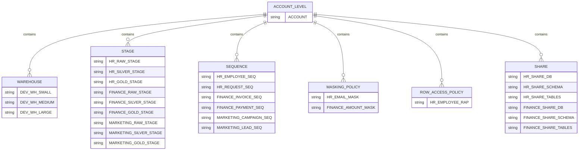

# Snowflake IAC Demo

This repo is my end-to-end Snowflake IaC demo. I use Terraform to provision a realistic analytics footprint: warehouses, databases, schemas, tables, views, sequences, streams, dynamic tables, stages, external tables, tasks, functions, procedures, masking policies, row access policies, Iceberg tables, hybrid tables, event tables, and data shares. I also show how I load data from stages into tables and how I run ad‑hoc SQL with SnowCLI.

## ER diagrams

### Account-level objects



### HR DB

```mermaid
%%{init: {"er": {"layoutDirection": "LR"}}}%%
erDiagram
    HR_DB {
        string HR
    }
    HR_PUBLIC_SCHEMA {
        string PUBLIC
    }

    HR_EMPLOYEES {
        number EMPLOYEE_ID
        string EMPLOYEE_NUMBER
        string FIRST_NAME
        string LAST_NAME
        string EMAIL
        date HIRE_DATE
        string JOB_TITLE
        number DEPARTMENT_ID
        string EMPLOYMENT_STATUS
    }
    HR_DEPARTMENTS {
        number DEPARTMENT_ID
        string DEPARTMENT_NAME
        string COST_CENTER
        number MANAGER_EMPLOYEE_ID
        string LOCATION
    }
    HR_POSITIONS {
        number POSITION_ID
        string POSITION_TITLE
        string JOB_FAMILY
        string GRADE
        boolean EXEMPT_FLAG
    }
    HR_BENEFITS {
        number BENEFIT_ID
        string BENEFIT_NAME
        string PLAN_CODE
        string PROVIDER
        boolean ACTIVE_FLAG
    }
    HR_TIME_OFF_REQUESTS {
        number REQUEST_ID
        number EMPLOYEE_ID
        date START_DATE
        date END_DATE
        number REQUESTED_DAYS
        string STATUS
    }
    HR_TRN_EMPLOYEE_EVENTS {
        number EVENT_ID
        number EMPLOYEE_ID
        string EVENT_TYPE
        timestamp EVENT_TS
        string SOURCE_SYSTEM
    }
    HR_TRN_BENEFIT_ENROLLMENTS {
        number ENROLLMENT_ID
        number EMPLOYEE_ID
        number BENEFIT_ID
        string PLAN_CODE
        date EFFECTIVE_DATE
    }
    HR_TMP_PAYROLL_CALC {
        number EMPLOYEE_ID
        string PAY_PERIOD
        number GROSS_PAY
        number NET_PAY
    }
    HR_TMP_HIRING_PIPELINE {
        number CANDIDATE_ID
        string ROLE
        string STAGE
        string SOURCE
    }
    HR_EXT_EMPLOYEES_RAW {
        number EMPLOYEE_ID
        string EMPLOYEE_NUMBER
        string FIRST_NAME
        string LAST_NAME
        string EMAIL
    }
    HR_ICEBERG_EMPLOYEES {
        number EMPLOYEE_ID
        string EMPLOYEE_NUMBER
        string FIRST_NAME
        string LAST_NAME
        string EMAIL
    }
    HR_HYBRID_EMPLOYEE_DIM {
        number EMPLOYEE_ID
        string FULL_NAME
        string EMAIL
        number DEPARTMENT_ID
        string JOB_TITLE
    }
    HR_EMPLOYEE_DIRECTORY {
        string EMPLOYEE_NAME
        string EMAIL
        string DEPARTMENT_NAME
    }
    HR_TIME_OFF_OVERVIEW {
        number REQUEST_ID
        date START_DATE
        date END_DATE
        string STATUS
    }
    HR_MV_EMP_COUNT_BY_DEPT {
        number DEPARTMENT_ID
        number EMPLOYEE_COUNT
    }
    HR_SEM_EMPLOYEE {
        number EMPLOYEE_ID
        number EMP_COUNT
    }
    HR_EMPLOYEES_STREAM {
        string STREAM_NAME
    }
    HR_EMPLOYEE_ROSTER_DT {
        number EMPLOYEE_ID
        string DEPARTMENT_NAME
    }
    HR_EMPLOYEE_EVENTS_DT {
        date EVENT_DATE
        string EVENT_TYPE
        number EVENT_COUNT
    }
    HR_EVENTS {
        string EVENT_TABLE
    }

    HR_DB ||--|| HR_PUBLIC_SCHEMA : contains
    HR_PUBLIC_SCHEMA ||--o{ HR_EMPLOYEES : contains
    HR_PUBLIC_SCHEMA ||--o{ HR_DEPARTMENTS : contains
    HR_PUBLIC_SCHEMA ||--o{ HR_POSITIONS : contains
    HR_PUBLIC_SCHEMA ||--o{ HR_BENEFITS : contains
    HR_PUBLIC_SCHEMA ||--o{ HR_TIME_OFF_REQUESTS : contains
    HR_PUBLIC_SCHEMA ||--o{ HR_TRN_EMPLOYEE_EVENTS : contains
    HR_PUBLIC_SCHEMA ||--o{ HR_TRN_BENEFIT_ENROLLMENTS : contains
    HR_PUBLIC_SCHEMA ||--o{ HR_TMP_PAYROLL_CALC : contains
    HR_PUBLIC_SCHEMA ||--o{ HR_TMP_HIRING_PIPELINE : contains
    HR_PUBLIC_SCHEMA ||--o{ HR_EXT_EMPLOYEES_RAW : contains
    HR_PUBLIC_SCHEMA ||--o{ HR_ICEBERG_EMPLOYEES : contains
    HR_PUBLIC_SCHEMA ||--o{ HR_HYBRID_EMPLOYEE_DIM : contains
    HR_PUBLIC_SCHEMA ||--o{ HR_EMPLOYEE_DIRECTORY : contains
    HR_PUBLIC_SCHEMA ||--o{ HR_TIME_OFF_OVERVIEW : contains
    HR_PUBLIC_SCHEMA ||--o{ HR_MV_EMP_COUNT_BY_DEPT : contains
    HR_PUBLIC_SCHEMA ||--o{ HR_SEM_EMPLOYEE : contains
    HR_PUBLIC_SCHEMA ||--o{ HR_EMPLOYEES_STREAM : contains
    HR_PUBLIC_SCHEMA ||--o{ HR_EMPLOYEE_ROSTER_DT : contains
    HR_PUBLIC_SCHEMA ||--o{ HR_EMPLOYEE_EVENTS_DT : contains
    HR_PUBLIC_SCHEMA ||--o{ HR_EVENTS : contains
```



### Finance DB

```mermaid
%%{init: {"er": {"layoutDirection": "LR"}}}%%
erDiagram
    FINANCE_DB {
        string FINANCE
    }
    FINANCE_PUBLIC_SCHEMA {
        string PUBLIC
    }

    FINANCE_ACCOUNTS {
        number ACCOUNT_ID
        string ACCOUNT_NUMBER
        string ACCOUNT_NAME
        string ACCOUNT_TYPE
        string GL_CODE
    }
    FINANCE_TRANSACTIONS {
        number TRANSACTION_ID
        number ACCOUNT_ID
        date TRANSACTION_DATE
        number AMOUNT
        string CURRENCY
        string STATUS
    }
    FINANCE_BUDGETS {
        number BUDGET_ID
        number FISCAL_YEAR
        number DEPARTMENT_ID
        number AMOUNT
        boolean APPROVED_FLAG
    }
    FINANCE_INVOICES {
        number INVOICE_ID
        string INVOICE_NUMBER
        number VENDOR_ID
        date INVOICE_DATE
        number TOTAL_AMOUNT
        string STATUS
    }
    FINANCE_PAYMENTS {
        number PAYMENT_ID
        number INVOICE_ID
        date PAYMENT_DATE
        number AMOUNT
        string METHOD
    }
    FINANCE_TRN_PAYMENT_EVENTS {
        number PAYMENT_EVENT_ID
        number PAYMENT_ID
        string EVENT_TYPE
        timestamp EVENT_TS
        number AMOUNT
    }
    FINANCE_TRN_GL_STAGING {
        number ENTRY_ID
        string JOURNAL_ID
        number ACCOUNT_ID
        string GL_ACCOUNT
        number AMOUNT
    }
    FINANCE_TMP_FORECAST {
        number FORECAST_ID
        string FISCAL_MONTH
        number FORECAST_AMOUNT
        string SCENARIO
    }
    FINANCE_TMP_CASHFLOW {
        date FLOW_DATE
        number INCOMING
        number OUTGOING
        number NET_FLOW
    }
    FINANCE_EXT_TRANSACTIONS_RAW {
        number TRANSACTION_ID
        number ACCOUNT_ID
        date TRANSACTION_DATE
        number AMOUNT
        string CURRENCY
    }
    FINANCE_ICEBERG_TRANSACTIONS {
        number TRANSACTION_ID
        number ACCOUNT_ID
        date TRANSACTION_DATE
        number AMOUNT
        string CURRENCY
    }
    FINANCE_HYBRID_ACCOUNT_DIM {
        number ACCOUNT_ID
        string ACCOUNT_NAME
        string ACCOUNT_TYPE
        string STATUS
    }
    FINANCE_OPEN_INVOICES {
        number INVOICE_ID
        string INVOICE_NUMBER
        date DUE_DATE
        number TOTAL_AMOUNT
    }
    FINANCE_ACCOUNT_ACTIVITY {
        number ACCOUNT_ID
        date TRANSACTION_DATE
        number AMOUNT
        string CATEGORY
    }
    FINANCE_MV_DAILY_PAYMENTS {
        date PAYMENT_DATE
        number TOTAL_AMOUNT
    }
    FINANCE_SEM_TRANSACTIONS {
        number TRANSACTION_ID
        number TOTAL_AMOUNT
    }
    FINANCE_INVOICES_STREAM {
        string STREAM_NAME
    }
    FINANCE_DAILY_TRANSACTIONS_DT {
        date TRANSACTION_DATE
        string CURRENCY
        number TOTAL_AMOUNT
    }
    FINANCE_PAYMENT_EVENTS_DT {
        date EVENT_DATE
        string PAYMENT_STATUS
        number EVENT_COUNT
    }
    FINANCE_EVENTS {
        string EVENT_TABLE
    }

    FINANCE_DB ||--|| FINANCE_PUBLIC_SCHEMA : contains
    FINANCE_PUBLIC_SCHEMA ||--o{ FINANCE_ACCOUNTS : contains
    FINANCE_PUBLIC_SCHEMA ||--o{ FINANCE_TRANSACTIONS : contains
    FINANCE_PUBLIC_SCHEMA ||--o{ FINANCE_BUDGETS : contains
    FINANCE_PUBLIC_SCHEMA ||--o{ FINANCE_INVOICES : contains
    FINANCE_PUBLIC_SCHEMA ||--o{ FINANCE_PAYMENTS : contains
    FINANCE_PUBLIC_SCHEMA ||--o{ FINANCE_TRN_PAYMENT_EVENTS : contains
    FINANCE_PUBLIC_SCHEMA ||--o{ FINANCE_TRN_GL_STAGING : contains
    FINANCE_PUBLIC_SCHEMA ||--o{ FINANCE_TMP_FORECAST : contains
    FINANCE_PUBLIC_SCHEMA ||--o{ FINANCE_TMP_CASHFLOW : contains
    FINANCE_PUBLIC_SCHEMA ||--o{ FINANCE_EXT_TRANSACTIONS_RAW : contains
    FINANCE_PUBLIC_SCHEMA ||--o{ FINANCE_ICEBERG_TRANSACTIONS : contains
    FINANCE_PUBLIC_SCHEMA ||--o{ FINANCE_HYBRID_ACCOUNT_DIM : contains
    FINANCE_PUBLIC_SCHEMA ||--o{ FINANCE_OPEN_INVOICES : contains
    FINANCE_PUBLIC_SCHEMA ||--o{ FINANCE_ACCOUNT_ACTIVITY : contains
    FINANCE_PUBLIC_SCHEMA ||--o{ FINANCE_MV_DAILY_PAYMENTS : contains
    FINANCE_PUBLIC_SCHEMA ||--o{ FINANCE_SEM_TRANSACTIONS : contains
    FINANCE_PUBLIC_SCHEMA ||--o{ FINANCE_INVOICES_STREAM : contains
    FINANCE_PUBLIC_SCHEMA ||--o{ FINANCE_DAILY_TRANSACTIONS_DT : contains
    FINANCE_PUBLIC_SCHEMA ||--o{ FINANCE_PAYMENT_EVENTS_DT : contains
    FINANCE_PUBLIC_SCHEMA ||--o{ FINANCE_EVENTS : contains
```



### Marketing DB

```mermaid
%%{init: {"er": {"layoutDirection": "LR"}}}%%
erDiagram
    MARKETING_DB {
        string MARKETING
    }
    MARKETING_PUBLIC_SCHEMA {
        string PUBLIC
    }

    MARKETING_CAMPAIGNS {
        number CAMPAIGN_ID
        string CAMPAIGN_NAME
        string CAMPAIGN_TYPE
        date START_DATE
        date END_DATE
        string STATUS
    }
    MARKETING_LEADS {
        number LEAD_ID
        string FIRST_NAME
        string LAST_NAME
        string EMAIL
        string SOURCE
        string STATUS
    }
    MARKETING_CHANNELS {
        number CHANNEL_ID
        string CHANNEL_NAME
        string CHANNEL_TYPE
        string PLATFORM
        boolean ACTIVE_FLAG
    }
    MARKETING_CONTENT {
        number CONTENT_ID
        string TITLE
        string CONTENT_TYPE
        string AUTHOR
        date PUBLISHED_DATE
    }
    MARKETING_ENGAGEMENTS {
        number ENGAGEMENT_ID
        number CAMPAIGN_ID
        number CHANNEL_ID
        date ENGAGEMENT_DATE
        string EVENT_TYPE
        number METRIC_VALUE
    }
    MARKETING_TRN_LEAD_EVENTS {
        number LEAD_EVENT_ID
        number LEAD_ID
        string EVENT_TYPE
        timestamp EVENT_TS
        string SOURCE
    }
    MARKETING_TRN_ATTRIBUTION_EVENTS {
        number ATTRIBUTION_ID
        number CAMPAIGN_ID
        number CHANNEL_ID
        string TOUCHPOINT
        number WEIGHT
    }
    MARKETING_TMP_SPEND_ALLOCATION {
        number CAMPAIGN_ID
        number CHANNEL_ID
        number BUDGET
        number ALLOCATION_PCT
    }
    MARKETING_TMP_LEAD_SCORES {
        number LEAD_ID
        number SCORE
        string MODEL_VERSION
        timestamp SCORED_AT
    }
    MARKETING_EXT_LEADS_RAW {
        number LEAD_ID
        string FIRST_NAME
        string LAST_NAME
        string EMAIL
        string STATUS
    }
    MARKETING_CAMPAIGN_PERFORMANCE {
        number CAMPAIGN_ID
        date ENGAGEMENT_DATE
        string EVENT_TYPE
        number METRIC_VALUE
    }
    MARKETING_LEAD_SOURCES {
        number LEAD_ID
        string SOURCE
        string STATUS
    }
    MARKETING_CAMPAIGN_METRICS_DT {
        number CAMPAIGN_ID
        string EVENT_TYPE
        number ENGAGEMENT_COUNT
    }
    MARKETING_LEADS_STREAM {
        string STREAM_NAME
    }

    MARKETING_DB ||--|| MARKETING_PUBLIC_SCHEMA : contains
    MARKETING_PUBLIC_SCHEMA ||--o{ MARKETING_CAMPAIGNS : contains
    MARKETING_PUBLIC_SCHEMA ||--o{ MARKETING_LEADS : contains
    MARKETING_PUBLIC_SCHEMA ||--o{ MARKETING_CHANNELS : contains
    MARKETING_PUBLIC_SCHEMA ||--o{ MARKETING_CONTENT : contains
    MARKETING_PUBLIC_SCHEMA ||--o{ MARKETING_ENGAGEMENTS : contains
    MARKETING_PUBLIC_SCHEMA ||--o{ MARKETING_TRN_LEAD_EVENTS : contains
    MARKETING_PUBLIC_SCHEMA ||--o{ MARKETING_TRN_ATTRIBUTION_EVENTS : contains
    MARKETING_PUBLIC_SCHEMA ||--o{ MARKETING_TMP_SPEND_ALLOCATION : contains
    MARKETING_PUBLIC_SCHEMA ||--o{ MARKETING_TMP_LEAD_SCORES : contains
    MARKETING_PUBLIC_SCHEMA ||--o{ MARKETING_EXT_LEADS_RAW : contains
    MARKETING_PUBLIC_SCHEMA ||--o{ MARKETING_CAMPAIGN_PERFORMANCE : contains
    MARKETING_PUBLIC_SCHEMA ||--o{ MARKETING_LEAD_SOURCES : contains
    MARKETING_PUBLIC_SCHEMA ||--o{ MARKETING_CAMPAIGN_METRICS_DT : contains
    MARKETING_PUBLIC_SCHEMA ||--o{ MARKETING_LEADS_STREAM : contains
```



### 1) Create S3 buckets (RAW / SILVER / GOLD)

#### Create RAW bucket

```bash
aws s3api create-bucket --bucket myorg-snowflake-raw --region us-east-1
```

#### Create SILVER bucket

```bash
aws s3api create-bucket --bucket myorg-snowflake-silver --region us-east-1
```

#### Create GOLD bucket

```bash
aws s3api create-bucket --bucket myorg-snowflake-gold --region us-east-1
```

For non‑`us-east-1`, add `--create-bucket-configuration LocationConstraint=<region>`.

### 2) Create Snowflake integrations (storage integration + external volume)

Example SQL (replace names/ARNs):

```sql
-- optional: IaC role + user
CREATE ROLE IAC_ROLE;
GRANT ROLE IAC_ROLE TO ROLE SYSADMIN;

CREATE USER IAC_USER
  PASSWORD = '<strong_password>'
  DEFAULT_ROLE = IAC_ROLE
  DEFAULT_WAREHOUSE = COMPUTE_WH
  MUST_CHANGE_PASSWORD = FALSE;

GRANT ROLE IAC_ROLE TO USER IAC_USER;
GRANT CREATE WAREHOUSE, CREATE DATABASE, CREATE SCHEMA, CREATE STAGE,
  CREATE TABLE, CREATE VIEW, CREATE MATERIALIZED VIEW, CREATE TASK
  TO ROLE IAC_ROLE;

-- storage integration for stages/external tables
CREATE STORAGE INTEGRATION S3_INT
  TYPE = EXTERNAL_STAGE
  STORAGE_PROVIDER = S3
  ENABLED = TRUE
  STORAGE_AWS_ROLE_ARN = '<iam_role_arn>'
  STORAGE_ALLOWED_LOCATIONS = (
    's3://myorg-snowflake-raw/',
    's3://myorg-snowflake-silver/',
    's3://myorg-snowflake-gold/'
  );

-- external volume for Iceberg tables
CREATE EXTERNAL VOLUME ICEBERG_EXT_VOL
  STORAGE_LOCATIONS = (
    (NAME = 'iceberg', STORAGE_PROVIDER = 'S3', STORAGE_BASE_URL = 's3://myorg-snowflake-raw/iceberg/')
  );
```

### 3) Configure Terraform inputs

```bash
cp envs/dev/terraform.tfvars.example envs/dev/terraform.tfvars
```

Then edit `envs/dev/terraform.tfvars` with your account/user/role, stage buckets, storage integration, and external volume.

### 4) Configure remote state (required for real environments)

I never store Terraform state in this repo. I keep state in a remote backend with encryption, versioning, and access controls, and I gate access with approvals (break‑glass only for admins).

Pick one of the following and enable it (the backend blocks are commented out in `envs/dev/terraform.tf`):

#### Option A: AWS S3 + DynamoDB locking

- S3 bucket with versioning + SSE
- DynamoDB table for state locking
- IAM role scoped to this state path

Example backend config (uncomment in `envs/dev/terraform.tf` and set your values):

```hcl
backend "s3" {
  bucket         = "myorg-terraform-state"
  key            = "snowflake-iac/dev/terraform.tfstate"
  region         = "us-east-1"
  dynamodb_table = "terraform-state-locks"
  encrypt        = true
}
```

#### Option B: Azure Storage + Azure AD

- Storage account + container
- Azure AD / RBAC for access

Example backend config (uncomment in `envs/dev/terraform.tf` and set your values):

```hcl
backend "azurerm" {
  resource_group_name  = "rg-terraform-state"
  storage_account_name = "mystatetfaccount"
  container_name       = "tfstate"
  key                  = "snowflake-iac/dev/terraform.tfstate"
}
```

### 5) Initialize Terraform (downloads the provider)

If you change or enable the backend, I re‑run init:

```bash
cd envs/dev
terraform init
```

### 6) Plan + apply

```bash
terraform plan -var-file=terraform.tfvars -out=tfplan
terraform apply tfplan
```

If I want to use a newly created warehouse for the provider session, I apply warehouses first, then update `snowflake_warehouse`:

```bash
terraform apply -var-file=terraform.tfvars -target=module.warehouses
```

### 7) Load data from stages into tables

Template:

```sql
COPY INTO "<DB>"."<SCHEMA>"."<TABLE>"
FROM @"<DB>"."<SCHEMA>"."<STAGE>"/<path>/
FILE_FORMAT = (TYPE = CSV FIELD_DELIMITER = ',' SKIP_HEADER = 1)
ON_ERROR = 'CONTINUE';
```

Example (HR employees from RAW stage):

```sql
COPY INTO "HR"."PUBLIC"."EMPLOYEES"
FROM @"HR"."PUBLIC"."RAW_STAGE"/employees/
FILE_FORMAT = (TYPE = CSV FIELD_DELIMITER = ',' SKIP_HEADER = 1)
ON_ERROR = 'CONTINUE';
```

### 8) Run SQL with SnowCLI (optional)

Install SnowCLI (macOS):

```bash
# I’m on macOS, so I install SnowCLI with Homebrew
brew tap snowflakedb/snowflake-cli
brew update
brew install snowflake-cli
```

If you’re not on macOS, use the Snowflake docs to pick the right installer for your OS.

Run SQL:

```bash
snow sql --query "COPY INTO \"HR\".\"PUBLIC\".\"EMPLOYEES\" FROM @\"HR\".\"PUBLIC\".\"RAW_STAGE\"/employees/ FILE_FORMAT=(TYPE=CSV FIELD_DELIMITER=',' SKIP_HEADER=1) ON_ERROR='CONTINUE';"
```

Or from a file:

```bash
snow sql --filename copy_into.sql
```

### 9) Destroy (optional)

```bash
terraform destroy -var-file=terraform.tfvars
```

## Objects Created

## Object Inventory

<!-- OBJECT_INVENTORY_START -->
| Category | Type | Names |
| --- | --- | --- |
| Platform | Warehouse | `DEV_WH_SMALL`, `DEV_WH_MEDIUM`, `DEV_WH_LARGE` |
| Core | Database | `HR`, `FINANCE`, `MARKETING` |
| Core | Schema | `HR.PUBLIC`, `FINANCE.PUBLIC`, `MARKETING.PUBLIC` |
| Core | Sequence | `HR_EMPLOYEE_SEQ`, `HR_REQUEST_SEQ`, `FINANCE_INVOICE_SEQ`, `FINANCE_PAYMENT_SEQ`, `MARKETING_CAMPAIGN_SEQ`, `MARKETING_LEAD_SEQ` |
| Data | Stage | `HR.RAW_STAGE`, `HR.SILVER_STAGE`, `HR.GOLD_STAGE`, `FINANCE.RAW_STAGE`, `FINANCE.SILVER_STAGE`, `FINANCE.GOLD_STAGE`, `MARKETING.RAW_STAGE`, `MARKETING.SILVER_STAGE`, `MARKETING.GOLD_STAGE` |
| Data | Table (base) | `HR.EMPLOYEES`, `HR.DEPARTMENTS`, `HR.POSITIONS`, `HR.BENEFITS`, `HR.TIME_OFF_REQUESTS`, `FINANCE.ACCOUNTS`, `FINANCE.TRANSACTIONS`, `FINANCE.BUDGETS`, `FINANCE.INVOICES`, `FINANCE.PAYMENTS`, `MARKETING.CAMPAIGNS`, `MARKETING.LEADS`, `MARKETING.CHANNELS`, `MARKETING.CONTENT`, `MARKETING.ENGAGEMENTS` |
| Data | Table (transient) | `HR.TRN_EMPLOYEE_EVENTS`, `HR.TRN_BENEFIT_ENROLLMENTS`, `FINANCE.TRN_PAYMENT_EVENTS`, `FINANCE.TRN_GL_STAGING`, `MARKETING.TRN_LEAD_EVENTS`, `MARKETING.TRN_ATTRIBUTION_EVENTS` |
| Data | Table (temporary) | `HR.TMP_PAYROLL_CALC`, `HR.TMP_HIRING_PIPELINE`, `FINANCE.TMP_FORECAST`, `FINANCE.TMP_CASHFLOW`, `MARKETING.TMP_SPEND_ALLOCATION`, `MARKETING.TMP_LEAD_SCORES` |
| Data | External table | `HR.EXT_EMPLOYEES_RAW`, `FINANCE.EXT_TRANSACTIONS_RAW`, `MARKETING.EXT_LEADS_RAW` |
| Data | Iceberg table | `HR.ICEBERG_EMPLOYEES`, `FINANCE.ICEBERG_TRANSACTIONS` |
| Data | Hybrid table | `HR.HYBRID_EMPLOYEE_DIM`, `FINANCE.HYBRID_ACCOUNT_DIM` |
| Data | Event table | `HR.EVENTS`, `FINANCE.EVENTS` |
| Data | View | `HR.EMPLOYEE_DIRECTORY`, `HR.TIME_OFF_OVERVIEW`, `FINANCE.OPEN_INVOICES`, `FINANCE.ACCOUNT_ACTIVITY`, `MARKETING.CAMPAIGN_PERFORMANCE`, `MARKETING.LEAD_SOURCES` |
| Data | Materialized view | `HR.MV_EMP_COUNT_BY_DEPT`, `FINANCE.MV_DAILY_PAYMENTS` |
| Data | Semantic view | `HR.SEM_EMPLOYEE`, `FINANCE.SEM_TRANSACTIONS` |
| Data | Stream | `HR.EMPLOYEES_STREAM`, `FINANCE.INVOICES_STREAM`, `MARKETING.LEADS_STREAM` |
| Data | Dynamic table | `HR.EMPLOYEE_ROSTER_DT`, `FINANCE.DAILY_TRANSACTIONS_DT`, `MARKETING.CAMPAIGN_METRICS_DT`, `HR.EMPLOYEE_EVENTS_DT`, `FINANCE.PAYMENT_EVENTS_DT` |
| Automation | Task | `HR.EMPLOYEE_EVENT_TASK`, `FINANCE.PAYMENT_ROLLUP_TASK` |
| Code | Function | `HR.NORMALIZE_EMAIL`, `FINANCE.FISCAL_YEAR` |
| Code | Procedure | `HR.LOG_EMP_EVENT`, `FINANCE.RECALC_DAILY_TRANSACTIONS` |
| Security | Masking policy | `HR.EMAIL_MASK`, `FINANCE.AMOUNT_MASK` |
| Security | Row access policy | `HR.EMPLOYEE_RAP` |
<!-- OBJECT_INVENTORY_END -->

## Table columns (detail)

<!-- TABLE_COLUMNS_START -->
<table>
<thead><tr><th>Table</th><th>Columns</th></tr></thead>
<tbody>
<tr>
<td valign="top"><code>FINANCE.ACCOUNTS</code></td>
<td valign="top"><table><tr><th>Name</th><th>Type</th></tr><tr><td>ACCOUNT_ID</td><td>NUMBER(38,0)</td></tr><tr><td>ACCOUNT_NUMBER</td><td>VARCHAR(30)</td></tr><tr><td>ACCOUNT_NAME</td><td>VARCHAR(150)</td></tr><tr><td>ACCOUNT_TYPE</td><td>VARCHAR(50)</td></tr><tr><td>GL_CODE</td><td>VARCHAR(20)</td></tr><tr><td>STATUS</td><td>VARCHAR(20)</td></tr><tr><td>OWNER_DEPARTMENT_ID</td><td>NUMBER(38,0)</td></tr><tr><td>OPENED_DATE</td><td>DATE</td></tr><tr><td>CLOSED_DATE</td><td>DATE</td></tr><tr><td>UPDATED_AT</td><td>TIMESTAMP_NTZ</td></tr></table></td>
</tr>
<tr>
<td valign="top"><code>FINANCE.BUDGETS</code></td>
<td valign="top"><table><tr><th>Name</th><th>Type</th></tr><tr><td>BUDGET_ID</td><td>NUMBER(38,0)</td></tr><tr><td>FISCAL_YEAR</td><td>NUMBER(4,0)</td></tr><tr><td>DEPARTMENT_ID</td><td>NUMBER(38,0)</td></tr><tr><td>AMOUNT</td><td>NUMBER(18,2)</td></tr><tr><td>APPROVED_FLAG</td><td>BOOLEAN</td></tr><tr><td>APPROVED_BY</td><td>NUMBER(38,0)</td></tr><tr><td>APPROVED_AT</td><td>TIMESTAMP_NTZ</td></tr><tr><td>CREATED_AT</td><td>TIMESTAMP_NTZ</td></tr></table></td>
</tr>
<tr>
<td valign="top"><code>FINANCE.EVENTS</code></td>
<td valign="top"><table><tr><th>Name</th><th>Type</th></tr><tr><td>(managed)</td><td>Snowflake event table</td></tr></table></td>
</tr>
<tr>
<td valign="top"><code>FINANCE.EXT_TRANSACTIONS_RAW</code></td>
<td valign="top"><table><tr><th>Name</th><th>Type</th></tr><tr><td>TRANSACTION_ID</td><td>NUMBER(38,0)</td></tr><tr><td>ACCOUNT_ID</td><td>NUMBER(38,0)</td></tr><tr><td>TRANSACTION_DATE</td><td>DATE</td></tr><tr><td>AMOUNT</td><td>NUMBER(18,2)</td></tr><tr><td>CURRENCY</td><td>VARCHAR</td></tr><tr><td>DESCRIPTION</td><td>VARCHAR</td></tr><tr><td>MERCHANT_NAME</td><td>VARCHAR</td></tr><tr><td>CATEGORY</td><td>VARCHAR</td></tr><tr><td>STATUS</td><td>VARCHAR</td></tr></table></td>
</tr>
<tr>
<td valign="top"><code>FINANCE.HYBRID_ACCOUNT_DIM</code></td>
<td valign="top"><table><tr><th>Name</th><th>Type</th></tr><tr><td>ACCOUNT_ID</td><td>NUMBER NOT NULL</td></tr><tr><td>ACCOUNT_NAME</td><td>STRING</td></tr><tr><td>ACCOUNT_TYPE</td><td>STRING</td></tr><tr><td>STATUS</td><td>STRING</td></tr><tr><td>UPDATED_AT</td><td>TIMESTAMP_NTZ</td></tr><tr><td>PRIMARY</td><td>KEY (ACCOUNT_ID)</td></tr></table></td>
</tr>
<tr>
<td valign="top"><code>FINANCE.ICEBERG_TRANSACTIONS</code></td>
<td valign="top"><table><tr><th>Name</th><th>Type</th></tr><tr><td>TRANSACTION_ID</td><td>NUMBER</td></tr><tr><td>ACCOUNT_ID</td><td>NUMBER</td></tr><tr><td>TRANSACTION_DATE</td><td>DATE</td></tr><tr><td>POSTED_TS</td><td>TIMESTAMP_NTZ</td></tr><tr><td>DESCRIPTION</td><td>STRING</td></tr><tr><td>AMOUNT</td><td>NUMBER(18,2)</td></tr><tr><td>CURRENCY</td><td>STRING</td></tr><tr><td>STATUS</td><td>STRING</td></tr></table></td>
</tr>
<tr>
<td valign="top"><code>FINANCE.INVOICES</code></td>
<td valign="top"><table><tr><th>Name</th><th>Type</th></tr><tr><td>INVOICE_ID</td><td>NUMBER(38,0)</td></tr><tr><td>INVOICE_NUMBER</td><td>VARCHAR(40)</td></tr><tr><td>VENDOR_ID</td><td>NUMBER(38,0)</td></tr><tr><td>INVOICE_DATE</td><td>DATE</td></tr><tr><td>DUE_DATE</td><td>DATE</td></tr><tr><td>TOTAL_AMOUNT</td><td>NUMBER(18,2)</td></tr><tr><td>STATUS</td><td>VARCHAR(20)</td></tr><tr><td>CREATED_AT</td><td>TIMESTAMP_NTZ</td></tr></table></td>
</tr>
<tr>
<td valign="top"><code>FINANCE.PAYMENTS</code></td>
<td valign="top"><table><tr><th>Name</th><th>Type</th></tr><tr><td>PAYMENT_ID</td><td>NUMBER(38,0)</td></tr><tr><td>INVOICE_ID</td><td>NUMBER(38,0)</td></tr><tr><td>PAYMENT_DATE</td><td>DATE</td></tr><tr><td>AMOUNT</td><td>NUMBER(18,2)</td></tr><tr><td>METHOD</td><td>VARCHAR(30)</td></tr><tr><td>PAYMENT_STATUS</td><td>VARCHAR(20)</td></tr><tr><td>REFERENCE_NUMBER</td><td>VARCHAR(50)</td></tr><tr><td>CREATED_AT</td><td>TIMESTAMP_NTZ</td></tr></table></td>
</tr>
<tr>
<td valign="top"><code>FINANCE.TMP_CASHFLOW</code></td>
<td valign="top"><table><tr><th>Name</th><th>Type</th></tr><tr><td>FLOW_DATE</td><td>DATE</td></tr><tr><td>INCOMING</td><td>NUMBER(18,2)</td></tr><tr><td>OUTGOING</td><td>NUMBER(18,2)</td></tr><tr><td>NET_FLOW</td><td>NUMBER(18,2)</td></tr><tr><td>UPDATED_AT</td><td>TIMESTAMP_NTZ</td></tr></table></td>
</tr>
<tr>
<td valign="top"><code>FINANCE.TMP_FORECAST</code></td>
<td valign="top"><table><tr><th>Name</th><th>Type</th></tr><tr><td>FORECAST_ID</td><td>NUMBER(38,0)</td></tr><tr><td>FISCAL_MONTH</td><td>VARCHAR(7)</td></tr><tr><td>FORECAST_AMOUNT</td><td>NUMBER(18,2)</td></tr><tr><td>SCENARIO</td><td>VARCHAR(50)</td></tr><tr><td>CREATED_AT</td><td>TIMESTAMP_NTZ</td></tr></table></td>
</tr>
<tr>
<td valign="top"><code>FINANCE.TRANSACTIONS</code></td>
<td valign="top"><table><tr><th>Name</th><th>Type</th></tr><tr><td>TRANSACTION_ID</td><td>NUMBER(38,0)</td></tr><tr><td>ACCOUNT_ID</td><td>NUMBER(38,0)</td></tr><tr><td>TRANSACTION_DATE</td><td>DATE</td></tr><tr><td>POSTED_TS</td><td>TIMESTAMP_NTZ</td></tr><tr><td>DESCRIPTION</td><td>VARCHAR(200)</td></tr><tr><td>MERCHANT_NAME</td><td>VARCHAR(150)</td></tr><tr><td>CATEGORY</td><td>VARCHAR(50)</td></tr><tr><td>AMOUNT</td><td>NUMBER(18,2)</td></tr><tr><td>CURRENCY</td><td>VARCHAR(3)</td></tr><tr><td>STATUS</td><td>VARCHAR(20)</td></tr></table></td>
</tr>
<tr>
<td valign="top"><code>FINANCE.TRN_GL_STAGING</code></td>
<td valign="top"><table><tr><th>Name</th><th>Type</th></tr><tr><td>ENTRY_ID</td><td>NUMBER(38,0)</td></tr><tr><td>JOURNAL_ID</td><td>VARCHAR(40)</td></tr><tr><td>ACCOUNT_ID</td><td>NUMBER(38,0)</td></tr><tr><td>GL_ACCOUNT</td><td>VARCHAR(20)</td></tr><tr><td>AMOUNT</td><td>NUMBER(18,2)</td></tr><tr><td>POSTED_DATE</td><td>DATE</td></tr><tr><td>DESCRIPTION</td><td>VARCHAR(200)</td></tr></table></td>
</tr>
<tr>
<td valign="top"><code>FINANCE.TRN_PAYMENT_EVENTS</code></td>
<td valign="top"><table><tr><th>Name</th><th>Type</th></tr><tr><td>PAYMENT_EVENT_ID</td><td>NUMBER(38,0)</td></tr><tr><td>PAYMENT_ID</td><td>NUMBER(38,0)</td></tr><tr><td>EVENT_TYPE</td><td>VARCHAR(50)</td></tr><tr><td>EVENT_TS</td><td>TIMESTAMP_NTZ</td></tr><tr><td>AMOUNT</td><td>NUMBER(18,2)</td></tr><tr><td>STATUS</td><td>VARCHAR(20)</td></tr></table></td>
</tr>
<tr>
<td valign="top"><code>HR.BENEFITS</code></td>
<td valign="top"><table><tr><th>Name</th><th>Type</th></tr><tr><td>BENEFIT_ID</td><td>NUMBER(38,0)</td></tr><tr><td>BENEFIT_NAME</td><td>VARCHAR(150)</td></tr><tr><td>BENEFIT_TYPE</td><td>VARCHAR(50)</td></tr><tr><td>PLAN_CODE</td><td>VARCHAR(50)</td></tr><tr><td>PROVIDER</td><td>VARCHAR(100)</td></tr><tr><td>COVERAGE_LEVEL</td><td>VARCHAR(50)</td></tr><tr><td>EMPLOYEE_COST</td><td>NUMBER(18,2)</td></tr><tr><td>EMPLOYER_COST</td><td>NUMBER(18,2)</td></tr><tr><td>EFFECTIVE_DATE</td><td>DATE</td></tr><tr><td>END_DATE</td><td>DATE</td></tr><tr><td>ACTIVE_FLAG</td><td>BOOLEAN</td></tr></table></td>
</tr>
<tr>
<td valign="top"><code>HR.DEPARTMENTS</code></td>
<td valign="top"><table><tr><th>Name</th><th>Type</th></tr><tr><td>DEPARTMENT_ID</td><td>NUMBER(38,0)</td></tr><tr><td>DEPARTMENT_NAME</td><td>VARCHAR(100)</td></tr><tr><td>COST_CENTER</td><td>VARCHAR(50)</td></tr><tr><td>MANAGER_EMPLOYEE_ID</td><td>NUMBER(38,0)</td></tr><tr><td>LOCATION</td><td>VARCHAR(100)</td></tr><tr><td>BUDGET_AMOUNT</td><td>NUMBER(18,2)</td></tr><tr><td>ACTIVE_FLAG</td><td>BOOLEAN</td></tr><tr><td>UPDATED_AT</td><td>TIMESTAMP_NTZ</td></tr></table></td>
</tr>
<tr>
<td valign="top"><code>HR.EMPLOYEES</code></td>
<td valign="top"><table><tr><th>Name</th><th>Type</th></tr><tr><td>EMPLOYEE_ID</td><td>NUMBER(38,0)</td></tr><tr><td>EMPLOYEE_NUMBER</td><td>VARCHAR(30)</td></tr><tr><td>FIRST_NAME</td><td>VARCHAR(100)</td></tr><tr><td>MIDDLE_NAME</td><td>VARCHAR(100)</td></tr><tr><td>LAST_NAME</td><td>VARCHAR(100)</td></tr><tr><td>PREFERRED_NAME</td><td>VARCHAR(100)</td></tr><tr><td>EMAIL</td><td>VARCHAR(200)</td></tr><tr><td>PHONE</td><td>VARCHAR(30)</td></tr><tr><td>HIRE_DATE</td><td>DATE</td></tr><tr><td>JOB_TITLE</td><td>VARCHAR(150)</td></tr><tr><td>DEPARTMENT_ID</td><td>NUMBER(38,0)</td></tr><tr><td>MANAGER_ID</td><td>NUMBER(38,0)</td></tr><tr><td>LOCATION</td><td>VARCHAR(100)</td></tr><tr><td>EMPLOYMENT_STATUS</td><td>VARCHAR(30)</td></tr><tr><td>BASE_SALARY</td><td>NUMBER(18,2)</td></tr><tr><td>SALARY_CURRENCY</td><td>VARCHAR(3)</td></tr><tr><td>LAST_PROMOTION_DATE</td><td>DATE</td></tr><tr><td>TERMINATION_DATE</td><td>DATE</td></tr><tr><td>UPDATED_AT</td><td>TIMESTAMP_NTZ</td></tr></table></td>
</tr>
<tr>
<td valign="top"><code>HR.EVENTS</code></td>
<td valign="top"><table><tr><th>Name</th><th>Type</th></tr><tr><td>(managed)</td><td>Snowflake event table</td></tr></table></td>
</tr>
<tr>
<td valign="top"><code>HR.EXT_EMPLOYEES_RAW</code></td>
<td valign="top"><table><tr><th>Name</th><th>Type</th></tr><tr><td>EMPLOYEE_ID</td><td>NUMBER(38,0)</td></tr><tr><td>EMPLOYEE_NUMBER</td><td>VARCHAR</td></tr><tr><td>FIRST_NAME</td><td>VARCHAR</td></tr><tr><td>LAST_NAME</td><td>VARCHAR</td></tr><tr><td>EMAIL</td><td>VARCHAR</td></tr><tr><td>HIRE_DATE</td><td>DATE</td></tr><tr><td>DEPARTMENT_ID</td><td>NUMBER(38,0)</td></tr><tr><td>JOB_TITLE</td><td>VARCHAR</td></tr><tr><td>EMPLOYMENT_STATUS</td><td>VARCHAR</td></tr><tr><td>BASE_SALARY</td><td>NUMBER(18,2)</td></tr><tr><td>SALARY_CURRENCY</td><td>VARCHAR</td></tr></table></td>
</tr>
<tr>
<td valign="top"><code>HR.HYBRID_EMPLOYEE_DIM</code></td>
<td valign="top"><table><tr><th>Name</th><th>Type</th></tr><tr><td>EMPLOYEE_ID</td><td>NUMBER NOT NULL</td></tr><tr><td>FULL_NAME</td><td>STRING</td></tr><tr><td>EMAIL</td><td>STRING</td></tr><tr><td>DEPARTMENT_ID</td><td>NUMBER</td></tr><tr><td>JOB_TITLE</td><td>STRING</td></tr><tr><td>EMPLOYMENT_STATUS</td><td>STRING</td></tr><tr><td>UPDATED_AT</td><td>TIMESTAMP_NTZ</td></tr><tr><td>PRIMARY</td><td>KEY (EMPLOYEE_ID)</td></tr></table></td>
</tr>
<tr>
<td valign="top"><code>HR.ICEBERG_EMPLOYEES</code></td>
<td valign="top"><table><tr><th>Name</th><th>Type</th></tr><tr><td>EMPLOYEE_ID</td><td>NUMBER</td></tr><tr><td>EMPLOYEE_NUMBER</td><td>STRING</td></tr><tr><td>FIRST_NAME</td><td>STRING</td></tr><tr><td>LAST_NAME</td><td>STRING</td></tr><tr><td>EMAIL</td><td>STRING</td></tr><tr><td>HIRE_DATE</td><td>DATE</td></tr><tr><td>JOB_TITLE</td><td>STRING</td></tr><tr><td>DEPARTMENT_ID</td><td>NUMBER</td></tr><tr><td>EMPLOYMENT_STATUS</td><td>STRING</td></tr><tr><td>BASE_SALARY</td><td>NUMBER(18,2)</td></tr><tr><td>SALARY_CURRENCY</td><td>STRING</td></tr></table></td>
</tr>
<tr>
<td valign="top"><code>HR.POSITIONS</code></td>
<td valign="top"><table><tr><th>Name</th><th>Type</th></tr><tr><td>POSITION_ID</td><td>NUMBER(38,0)</td></tr><tr><td>POSITION_TITLE</td><td>VARCHAR(150)</td></tr><tr><td>JOB_FAMILY</td><td>VARCHAR(80)</td></tr><tr><td>GRADE</td><td>VARCHAR(20)</td></tr><tr><td>EXEMPT_FLAG</td><td>BOOLEAN</td></tr><tr><td>MIN_SALARY</td><td>NUMBER(18,2)</td></tr><tr><td>MAX_SALARY</td><td>NUMBER(18,2)</td></tr><tr><td>CREATED_AT</td><td>TIMESTAMP_NTZ</td></tr><tr><td>UPDATED_AT</td><td>TIMESTAMP_NTZ</td></tr></table></td>
</tr>
<tr>
<td valign="top"><code>HR.TIME_OFF_REQUESTS</code></td>
<td valign="top"><table><tr><th>Name</th><th>Type</th></tr><tr><td>REQUEST_ID</td><td>NUMBER(38,0)</td></tr><tr><td>EMPLOYEE_ID</td><td>NUMBER(38,0)</td></tr><tr><td>START_DATE</td><td>DATE</td></tr><tr><td>END_DATE</td><td>DATE</td></tr><tr><td>REQUESTED_DAYS</td><td>NUMBER(5,2)</td></tr><tr><td>STATUS</td><td>VARCHAR(30)</td></tr><tr><td>REASON</td><td>VARCHAR(200)</td></tr><tr><td>REQUESTED_AT</td><td>TIMESTAMP_NTZ</td></tr><tr><td>APPROVED_BY</td><td>NUMBER(38,0)</td></tr><tr><td>APPROVED_AT</td><td>TIMESTAMP_NTZ</td></tr></table></td>
</tr>
<tr>
<td valign="top"><code>HR.TMP_HIRING_PIPELINE</code></td>
<td valign="top"><table><tr><th>Name</th><th>Type</th></tr><tr><td>CANDIDATE_ID</td><td>NUMBER(38,0)</td></tr><tr><td>ROLE</td><td>VARCHAR(100)</td></tr><tr><td>STAGE</td><td>VARCHAR(50)</td></tr><tr><td>SOURCE</td><td>VARCHAR(50)</td></tr><tr><td>UPDATED_AT</td><td>TIMESTAMP_NTZ</td></tr></table></td>
</tr>
<tr>
<td valign="top"><code>HR.TMP_PAYROLL_CALC</code></td>
<td valign="top"><table><tr><th>Name</th><th>Type</th></tr><tr><td>EMPLOYEE_ID</td><td>NUMBER(38,0)</td></tr><tr><td>PAY_PERIOD</td><td>VARCHAR(20)</td></tr><tr><td>GROSS_PAY</td><td>NUMBER(18,2)</td></tr><tr><td>NET_PAY</td><td>NUMBER(18,2)</td></tr><tr><td>TAX_WITHHELD</td><td>NUMBER(18,2)</td></tr><tr><td>CALCULATED_AT</td><td>TIMESTAMP_NTZ</td></tr></table></td>
</tr>
<tr>
<td valign="top"><code>HR.TRN_BENEFIT_ENROLLMENTS</code></td>
<td valign="top"><table><tr><th>Name</th><th>Type</th></tr><tr><td>ENROLLMENT_ID</td><td>NUMBER(38,0)</td></tr><tr><td>EMPLOYEE_ID</td><td>NUMBER(38,0)</td></tr><tr><td>BENEFIT_ID</td><td>NUMBER(38,0)</td></tr><tr><td>PLAN_CODE</td><td>VARCHAR(50)</td></tr><tr><td>EFFECTIVE_DATE</td><td>DATE</td></tr><tr><td>ENROLLMENT_STATUS</td><td>VARCHAR(30)</td></tr><tr><td>CREATED_AT</td><td>TIMESTAMP_NTZ</td></tr></table></td>
</tr>
<tr>
<td valign="top"><code>HR.TRN_EMPLOYEE_EVENTS</code></td>
<td valign="top"><table><tr><th>Name</th><th>Type</th></tr><tr><td>EVENT_ID</td><td>NUMBER(38,0)</td></tr><tr><td>EMPLOYEE_ID</td><td>NUMBER(38,0)</td></tr><tr><td>EVENT_TYPE</td><td>VARCHAR(100)</td></tr><tr><td>EVENT_TS</td><td>TIMESTAMP_NTZ</td></tr><tr><td>SOURCE_SYSTEM</td><td>VARCHAR(50)</td></tr><tr><td>EVENT_PAYLOAD</td><td>VARIANT</td></tr></table></td>
</tr>
<tr>
<td valign="top"><code>MARKETING.CAMPAIGNS</code></td>
<td valign="top"><table><tr><th>Name</th><th>Type</th></tr><tr><td>CAMPAIGN_ID</td><td>NUMBER(38,0)</td></tr><tr><td>CAMPAIGN_NAME</td><td>VARCHAR(150)</td></tr><tr><td>CAMPAIGN_TYPE</td><td>VARCHAR(50)</td></tr><tr><td>START_DATE</td><td>DATE</td></tr><tr><td>END_DATE</td><td>DATE</td></tr><tr><td>STATUS</td><td>VARCHAR(30)</td></tr><tr><td>BUDGET</td><td>NUMBER(18,2)</td></tr><tr><td>OWNER</td><td>VARCHAR(100)</td></tr><tr><td>CREATED_AT</td><td>TIMESTAMP_NTZ</td></tr></table></td>
</tr>
<tr>
<td valign="top"><code>MARKETING.CHANNELS</code></td>
<td valign="top"><table><tr><th>Name</th><th>Type</th></tr><tr><td>CHANNEL_ID</td><td>NUMBER(38,0)</td></tr><tr><td>CHANNEL_NAME</td><td>VARCHAR(100)</td></tr><tr><td>CHANNEL_TYPE</td><td>VARCHAR(50)</td></tr><tr><td>PLATFORM</td><td>VARCHAR(50)</td></tr><tr><td>REGION</td><td>VARCHAR(50)</td></tr><tr><td>COST_PER_LEAD</td><td>NUMBER(18,2)</td></tr><tr><td>ACTIVE_FLAG</td><td>BOOLEAN</td></tr><tr><td>CREATED_AT</td><td>TIMESTAMP_NTZ</td></tr></table></td>
</tr>
<tr>
<td valign="top"><code>MARKETING.CONTENT</code></td>
<td valign="top"><table><tr><th>Name</th><th>Type</th></tr><tr><td>CONTENT_ID</td><td>NUMBER(38,0)</td></tr><tr><td>TITLE</td><td>VARCHAR(200)</td></tr><tr><td>CONTENT_TYPE</td><td>VARCHAR(50)</td></tr><tr><td>AUTHOR</td><td>VARCHAR(100)</td></tr><tr><td>URL</td><td>VARCHAR(500)</td></tr><tr><td>WORD_COUNT</td><td>NUMBER(10,0)</td></tr><tr><td>PUBLISHED_DATE</td><td>DATE</td></tr><tr><td>STATUS</td><td>VARCHAR(30)</td></tr><tr><td>CREATED_AT</td><td>TIMESTAMP_NTZ</td></tr></table></td>
</tr>
<tr>
<td valign="top"><code>MARKETING.ENGAGEMENTS</code></td>
<td valign="top"><table><tr><th>Name</th><th>Type</th></tr><tr><td>ENGAGEMENT_ID</td><td>NUMBER(38,0)</td></tr><tr><td>CAMPAIGN_ID</td><td>NUMBER(38,0)</td></tr><tr><td>CHANNEL_ID</td><td>NUMBER(38,0)</td></tr><tr><td>ENGAGEMENT_DATE</td><td>DATE</td></tr><tr><td>EVENT_TYPE</td><td>VARCHAR(50)</td></tr><tr><td>SOURCE</td><td>VARCHAR(50)</td></tr><tr><td>METRIC_VALUE</td><td>NUMBER(18,2)</td></tr><tr><td>CREATED_AT</td><td>TIMESTAMP_NTZ</td></tr></table></td>
</tr>
<tr>
<td valign="top"><code>MARKETING.EXT_LEADS_RAW</code></td>
<td valign="top"><table><tr><th>Name</th><th>Type</th></tr><tr><td>LEAD_ID</td><td>NUMBER(38,0)</td></tr><tr><td>FIRST_NAME</td><td>VARCHAR</td></tr><tr><td>LAST_NAME</td><td>VARCHAR</td></tr><tr><td>EMAIL</td><td>VARCHAR</td></tr><tr><td>PHONE</td><td>VARCHAR</td></tr><tr><td>COMPANY</td><td>VARCHAR</td></tr><tr><td>SOURCE</td><td>VARCHAR</td></tr><tr><td>STATUS</td><td>VARCHAR</td></tr></table></td>
</tr>
<tr>
<td valign="top"><code>MARKETING.LEADS</code></td>
<td valign="top"><table><tr><th>Name</th><th>Type</th></tr><tr><td>LEAD_ID</td><td>NUMBER(38,0)</td></tr><tr><td>FIRST_NAME</td><td>VARCHAR(100)</td></tr><tr><td>LAST_NAME</td><td>VARCHAR(100)</td></tr><tr><td>EMAIL</td><td>VARCHAR(200)</td></tr><tr><td>PHONE</td><td>VARCHAR(30)</td></tr><tr><td>COMPANY</td><td>VARCHAR(150)</td></tr><tr><td>TITLE</td><td>VARCHAR(100)</td></tr><tr><td>SOURCE</td><td>VARCHAR(50)</td></tr><tr><td>STATUS</td><td>VARCHAR(30)</td></tr><tr><td>CREATED_AT</td><td>TIMESTAMP_NTZ</td></tr></table></td>
</tr>
<tr>
<td valign="top"><code>MARKETING.TMP_LEAD_SCORES</code></td>
<td valign="top"><table><tr><th>Name</th><th>Type</th></tr><tr><td>LEAD_ID</td><td>NUMBER(38,0)</td></tr><tr><td>SCORE</td><td>NUMBER(5,2)</td></tr><tr><td>MODEL_VERSION</td><td>VARCHAR(20)</td></tr><tr><td>SCORED_AT</td><td>TIMESTAMP_NTZ</td></tr><tr><td>SCORE_REASON</td><td>VARCHAR(200)</td></tr></table></td>
</tr>
<tr>
<td valign="top"><code>MARKETING.TMP_SPEND_ALLOCATION</code></td>
<td valign="top"><table><tr><th>Name</th><th>Type</th></tr><tr><td>CAMPAIGN_ID</td><td>NUMBER(38,0)</td></tr><tr><td>CHANNEL_ID</td><td>NUMBER(38,0)</td></tr><tr><td>BUDGET</td><td>NUMBER(18,2)</td></tr><tr><td>ALLOCATION_PCT</td><td>NUMBER(5,2)</td></tr><tr><td>UPDATED_AT</td><td>TIMESTAMP_NTZ</td></tr></table></td>
</tr>
<tr>
<td valign="top"><code>MARKETING.TRN_ATTRIBUTION_EVENTS</code></td>
<td valign="top"><table><tr><th>Name</th><th>Type</th></tr><tr><td>ATTRIBUTION_ID</td><td>NUMBER(38,0)</td></tr><tr><td>CAMPAIGN_ID</td><td>NUMBER(38,0)</td></tr><tr><td>CHANNEL_ID</td><td>NUMBER(38,0)</td></tr><tr><td>TOUCHPOINT</td><td>VARCHAR(100)</td></tr><tr><td>MODEL</td><td>VARCHAR(50)</td></tr><tr><td>WEIGHT</td><td>NUMBER(9,4)</td></tr><tr><td>EVENT_TS</td><td>TIMESTAMP_NTZ</td></tr></table></td>
</tr>
<tr>
<td valign="top"><code>MARKETING.TRN_LEAD_EVENTS</code></td>
<td valign="top"><table><tr><th>Name</th><th>Type</th></tr><tr><td>LEAD_EVENT_ID</td><td>NUMBER(38,0)</td></tr><tr><td>LEAD_ID</td><td>NUMBER(38,0)</td></tr><tr><td>EVENT_TYPE</td><td>VARCHAR(50)</td></tr><tr><td>EVENT_TS</td><td>TIMESTAMP_NTZ</td></tr><tr><td>SOURCE</td><td>VARCHAR(50)</td></tr><tr><td>SCORE</td><td>NUMBER(5,2)</td></tr><tr><td>EVENT_PAYLOAD</td><td>VARIANT</td></tr></table></td>
</tr>
</tbody>
</table>
<!-- TABLE_COLUMNS_END -->


## Notes

- Some resources are preview in the provider (materialized views, semantic views, functions, procedures, external tables, table column masking policy application, shares). I enable them in `preview_features_enabled` in `envs/dev/terraform.tf`.
- Iceberg, hybrid, and event tables are created with `snowflake_execute` (SQL). They require account-level objects (external volume, etc.).
- Temporary tables are session‑scoped in Snowflake; they may be dropped when the provider session ends.
